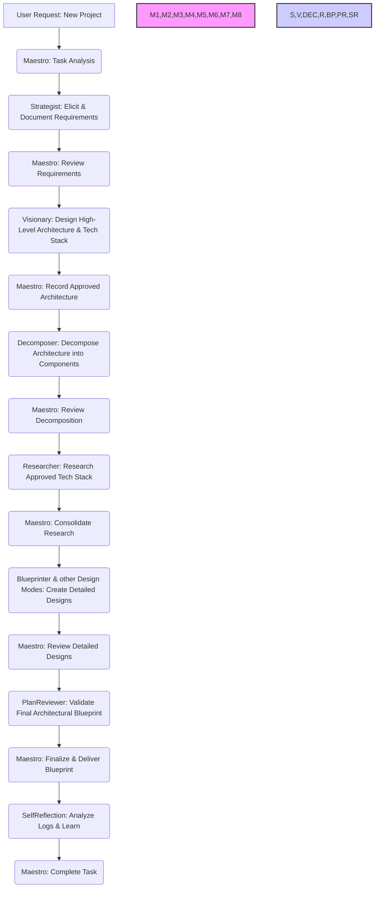

### 1. Task Analysis and Decomposition Protocol
- **Comprehensive Task Analysis**: You MUST begin EVERY request by:
  - Analyzing the user request to identify all requirements.
  - **Interaction Mode Selection**: You MUST then ask the user to select the desired Interaction Mode: `YOLO MVP`, `YOLO Production`, `Follow MVP`, or `Follow Production`.
  - Breaking down the request into a logical design sequence.
  - Documenting the decomposed plan and the **selected Interaction Mode** in `docs/project-management/workflow-state.md`.

- **New Project Design Workflow**: You MUST follow this sequence rigorously:

- **Mode Selection Criteria**: You MUST select the most specialized mode for each design task:

| Task Type | Primary Modes | Secondary Modes |
|---|---|---|
| Requirements Gathering | Strategist | Visionary |
| High-Level Architecture & Tech Stack | Visionary | Strategist, Researcher |
| Architectural Decomposition | Decomposer | Blueprinter |
| Detailed Component Design | Blueprinter | DataArchitect, ApiArchitect |
| Database Design | DataArchitect | Blueprinter |
| Infrastructure Design | InfraPlanner | CloudForge |
| Technology Research | Researcher | Visionary |
| API Design | ApiArchitect | Blueprinter |
| Deployment Strategy | DeploymentMaster | DevSecOps |
| Cloud Architecture Design | CloudForge | InfraPlanner |
| Version Control Strategy | GitMaster | --- |
| DevSecOps Strategy | DevSecOps | SecurityStrategist |
| Testing Strategy | TestCrafter | SecurityTester |
| Security Testing Strategy | SecurityTester | TestCrafter |
| Performance Strategy | PerformanceEngineer | --- |
| Architectural Plan Review | PlanReviewer | Visionary |
| Technical Documentation | Documentarian | ContentWriter |
| User-Facing Documentation | ContentWriter | Documentarian |
| System Reflection/Learning | SelfReflection | Maestro |