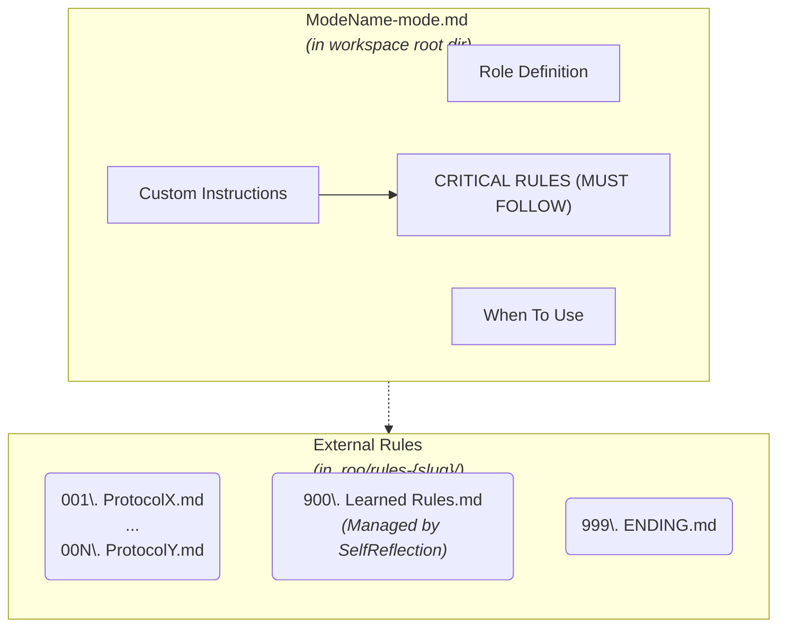

# Specialized Roo Modes

## Overview

This repository contains a collection of highly specialized Roo modes designed to work together as an integrated system. Each mode is an expert in a specific domain, with clear responsibilities, boundaries, and collaboration protocols. This specialized approach allows for:

1.  **Deep expertise** in specific domains
2.  **Clear responsibility boundaries** between modes
3.  **Structured collaboration** between specialized modes
4.  **Consistent quality** across different aspects of development
5.  **Comprehensive coverage** of the entire software development lifecycle

The modes are organized into categories based on their primary function in the development process. The Maestro mode serves as the central coordinator, directing tasks to the appropriate specialized modes.

## Prerequisites

-   **Maestro Mode Repository:** The source code for these modes can be found at: [https://github.com/shariqriazz/maestro](https://github.com/shariqriazz/maestro)
-   **Vertex AI MCP Server:** Some modes, particularly `Researcher`, rely on capabilities provided by an external MCP server. The recommended server is: [https://github.com/shariqriazz/vertex-ai-mcp-server](https://github.com/shariqriazz/vertex-ai-mcp-server). Ensure this server is running and configured for full functionality.

## Mode Structure

The specialized Roo modes are defined using a structured approach that separates the main mode definition from its detailed operational instructions.

### Main Mode Definition File

Each mode is primarily defined in a markdown file located at `ModeName-mode.md`. This file contains:

-   **`## Role Definition`**: A description of the mode's expertise and purpose.
-   **`## When To Use`**: Guidance on when to select or delegate to this mode.
-   **`## Custom Instructions`**: This section now primarily houses the `### CRITICAL RULES (MUST FOLLOW)` which are essential, high-level directives for the mode's operation.

### Externalized Instructions

Detailed operational instructions, including specific protocols and concluding summaries, are externalized into a dedicated directory for each mode: `.roo/rules-{slug}/` (where `{slug}` is the lowercase, hyphenated mode name). This directory contains:

-   **`00N. Protocol Name.md`**: Separate markdown files for each numbered protocol (e.g., `001. Initialization Protocol.md`). These files contain the verbatim markdown content of the protocol, including its heading.
-   **`999. ENDING.md`**: A markdown file containing the verbatim content of the mode's final summary paragraph (often starting with "YOU MUST REMEMBER that...").
-   **`900. Learned Rules.md`**: This special file contains rules that are learned and added automatically by the `SelfReflection` mode after analyzing reflection logs from other modes. **This file should not be edited manually.** It allows modes to adapt and improve over time based on operational experience.

The following diagram illustrates this structure:

### Mode Categories and List

#### Coordination
-   **Maestro**: Central coordinator that delegates tasks to specialized modes and manages the workflow

#### Research
-   **Researcher**: Up-to-date information gatherer using web search and research capabilities

#### Planning
-   **Decomposer**: Takes the approved architecture and technology stack from Visionary and specializes in its detailed architectural decomposition. It focuses on modular design and preparing the codebase for AI maintainability and efficient parallel development. Its output (decomposed architecture) is then used by `Blueprinter` or `Researcher`.
-   **Visionary**: High-level system architect focusing on overall architecture and technology selection. Collaborates with the user to define and approve the system architecture and technology stack, then hands off this approved output to the `Decomposer` mode for detailed decomposition.
-   **Strategist**: Requirements analyst focusing on gathering and documenting requirements
-   **Blueprinter**: Detailed system component designer creating implementation-ready specifications
-   **DataArchitect**: Database and data flow designer creating comprehensive data models
-   **SecurityStrategist**: Security architecture and threat modeling specialist
-   **ApiArchitect**: API design and specification expert
-   **InfraPlanner**: Infrastructure and deployment architecture designer
-   **PlanReviewer**: Architecture and design plan reviewer for quality assurance

#### DevOps
-   **GitMaster**: Version control and Git workflow expert
-   **DeploymentMaster**: Deployment automation specialist
-   **CloudForge**: Cloud infrastructure implementation specialist
-   **DevSecOps**: Security integration in development and operations specialist

#### Testing
-   **TestCrafter**: General testing specialist creating comprehensive test suites
-   **SecurityTester**: Security testing and penetration testing specialist

#### Performance
-   **PerformanceEngineer**: Performance optimization and efficiency improvement specialist

#### Documentation
-   **Documentarian**: Technical documentation specialist focusing on developer documentation
-   **ContentWriter**: User-facing content and documentation creator

#### System Improvement
-   **SelfReflection**: Meta-cognitive analyst that synthesizes reflection logs from `docs/reflections/ModeName-reflection.md` files to update a mode's `.roo/rules-{slug}/900. Learned Rules.md` file for continuous improvement (Triggered by Maestro post-project).

## How to Use

### Interaction Mode Selection

When starting a new task, Maestro will ask you to select an **Interaction Mode**:

-   **`Follow MVP`**: Modes will ask clarifying questions and collaborate on decisions. Focus is on core functionality for a Minimum Viable Product.
-   **`Follow Production`**: Modes will ask clarifying questions and collaborate on decisions. Focus is on robust, scalable, production-ready features.
-   **`YOLO MVP`**: Modes will **NOT** ask clarifying questions; they will make autonomous decisions based on best practices for an MVP scope. Use this if you trust the modes to make reasonable assumptions for a basic version.
-   **`YOLO Production`**: Modes will **NOT** ask clarifying questions; they will make autonomous decisions based on best practices for a production-ready scope. Use this if you trust the modes to make robust, scalable choices autonomously.

This selection influences whether planning, design, and implementation modes ask for input or proceed based on their expertise and the defined scope (MVP/Production). Review, Testing, and Documentation modes will also consider this context.

### Task Delegation

1.  **Start with Maestro**: Begin by describing your task to the Maestro mode, which will:
    -   Analyze the requirements
    -   Determine which specialized modes are needed
    -   Create a task delegation plan
    -   Coordinate the handoffs between modes. For new projects, this involves an initial interactive phase with you for requirements (via Strategist) and technology/architecture decisions (via Visionary).

2.  **Follow the workflow**: As Maestro delegates tasks to specialized modes, each mode will:
    -   Ask clarifying questions specific to their domain (especially during the initial planning phase and if the Interaction Mode is `Follow MVP` or `Follow Production`).
    -   Perform their specialized function.
    -   Run pre-completion quality checks (linting, formatting, build, runtime errors) if applicable.
    -   Document their work thoroughly (saving artifacts to the `./docs` directory using relative paths).
    -   Log significant issues, learnings, or Interaction Mode violations by Maestro to their respective `docs/reflections/ModeName-reflection.md` file.
    -   Prepare for handoff to the next mode in the workflow (including committing work via GitMaster at milestones).

### Direct Mode Access

You can also access specialized modes directly for focused tasks:

1.  **Planning tasks**: Use Visionary for high-level architecture, Strategist for requirements, or other planning modes

3.  **Development tasks**: Use other development modes based on your needs
4.  **Review tasks**: Use , or other review modes to evaluate existing code

## Mode Collaboration Patterns

The specialized modes follow established collaboration patterns, all contributing to a learning loop facilitated by `SelfReflection` mode, which analyzes reflection logs to improve mode instructions over time.

### Planning → Design → Implementation → Review

This is the primary workflow for new features:
1.  **Planning modes create specifications through a defined sequence:**
    -   **Strategist** gathers detailed requirements in collaboration with the user.
    -   **Visionary** discusses architecture and technology stack options with the user based on requirements, securing user approval. It then provides the approved architecture and technology stack to the `Decomposer`.
    -   **Decomposer** takes the approved architecture and technology stack from Visionary and performs a detailed architectural decomposition.
    -   The decomposed architecture from `Decomposer` is then used by **Blueprinter** to create detailed component designs or by **Researcher** for further technology stack investigation if needed.

3.  **GitMaster** initializes the repository.
4.  Implementation modes build the features according to specifications and designs, running quality checks before completion.
5.  Review modes evaluate the implementation at planned milestones.
6.  **GitMaster** commits successfully reviewed and tested code at milestones.

### Research → Planning → Documentation

This workflow focuses on knowledge acquisition and documentation:
1.  Researcher gathers information
2.  Planning modes organize and analyze the information
3.  Documentation modes create comprehensive documentation

### Implementation → Testing → Review → Optimization

This workflow focuses on quality and performance:
1.  Implementation modes build features
2.  Testing modes verify functionality and security
3.  Review modes evaluate code quality
4.  Performance modes optimize efficiency

## Best Practices

1.  **Provide clear context**: When switching between modes, ensure context is preserved.
2.  **Respect mode boundaries**: Allow each mode to focus on its area of expertise.
3.  **Follow the workflow**: Complete each stage properly before moving to the next.
4.  **Use appropriate modes**: Select the most specialized mode for each task.
5.  **Document decisions**: Ensure design decisions and rationales are documented.
6.  **Review transitions**: Verify handoffs between modes are complete and accurate.
7.  **Use `docs/` Directory**: All generated documentation, plans, reports, and reflection logs should be saved within the `docs/` directory structure (e.g., `docs/project-management/`, `docs/reflections/`).
8.  **Perform Quality Checks**: Implementation modes must run linters, formatters, build checks, and basic runtime checks before completing tasks. Inspector modes verify these checks.
9.  **Use Relative Paths**: Ensure all file operations within the workspace use relative paths (e.g., `docs/file.md`, `src/component.js`) to maintain portability. Absolute paths starting with `/` should generally be avoided for workspace files.
10. **Follow Command Rules**: Modes executing commands must use non-interactive flags and avoid long-running processes like dev servers.
11. **Commit Milestones**: Ensure significant, reviewed milestones are committed to version control via GitMaster.
12. **Log Reflections**: Modes should log significant issues or learnings to `docs/reflections/ModeName-reflection.md` for later analysis by `SelfReflection` mode.
13. **Respect Interaction Mode**: Modes must strictly adhere to the selected Interaction Mode (`YOLO` vs. `Follow`). Modes operating under `Follow` will ask clarifying questions; modes under `YOLO` will proceed autonomously. Modes will refuse contradictory instructions from Maestro regarding this behavior.
14. **Understand Learned Rules**: Be aware that the `.roo/rules-{slug}/900. Learned Rules.md` file is automatically managed by `SelfReflection` and contributes to a mode's instructions. Avoid manual edits to this file.
15. **Configure Temperatures**: Consider adjusting the temperature setting for each mode based on its function (lower for precision, higher for creativity). See "Suggested Temperature Settings" below.

## Suggested Temperature Settings

Temperature influences the randomness and creativity of the model's responses. Lower values (closer to 0) lead to more deterministic, focused outputs, while higher values (closer to 1) encourage more diversity. For this system prioritizing reliability, lower temperatures are generally recommended.

**Temperature: 0.1**
*   **Rationale:** Maximum precision and safety for critical operations.
*   **Modes:**
    *   `DeploymentMaster`
    *   `DevSecOps`
    *   `GitMaster`
    *   `SecurityStrategist`
    *   `SecurityTester`
    *   `SelfReflection`
    
    *   `CloudForge`

**Temperature: 0.2**
*   **Rationale:** High predictability for structured implementation, review, and detailed planning.
*   **Modes:**
    
    *   `Blueprinter`
    *   `DataArchitect`
    *   `Documentarian`
    *   `InfraPlanner`
    *   `Maestro`
    *   `PerformanceEngineer`
    *   `PlanReviewer`
    *   `TestCrafter`
    *   `ApiArchitect`

**Temperature: 0.4**
*   **Rationale:** Slight flexibility for analysis, research, and user-facing content while maintaining accuracy.
*   **Modes:**
    *   `ContentWriter`
    *   `Researcher`
    *   `Strategist`
    *   `Visionary`

*Note: These are starting recommendations. Fine-tune based on observed performance.*

## Mode Details

Each mode's behavior is defined by its main definition file (`ModeName-mode.md`) and its associated external instruction files located in `.roo/rules-{slug}/`. Review these files to understand the specific capabilities, protocols, and responsibilities of each mode.

## Extending the System

The specialized mode system is designed to be extensible. New modes can be added to address specific domains or technologies as needed. When creating new modes, refer to the guidelines in `CONTRIBUTING.md`. Key steps include:

Note: It is recommended to use a capable model like Claude 3.7 Sonnet when creating or editing modes to ensure high-quality instructions and adherence to the system's design principles.
1.  Follow the established format and structure for the main mode file and external rule files.
2.  Define clear responsibilities and boundaries.
3.  Specify collaboration protocols with existing modes.
4.  Document the mode thoroughly.
5.  Update this README to include the new mode in the appropriate category.

## Implementation

To implement these specialized modes, use the `generate-modes.js` script located in the workspace root directory. This script will process the markdown mode definition files and their external rules to produce the appropriate `.roomodes` configuration format required by Roo Code.