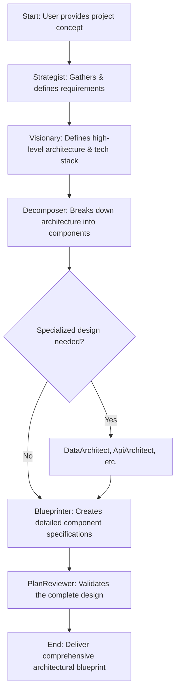

# Specialized Roo Modes: Architectural Design System

## Overview

This repository contains a collection of highly specialized Roo modes designed to work together as an integrated **architectural design system**. The system's primary purpose is to collaborate with users to produce comprehensive, high-quality architectural designs, technical specifications, and strategic plans. It does **not** write application code.

This specialized approach allows for:

1.  **Deep expertise** in specific design domains
2.  **Clear responsibility boundaries** between modes
3.  **Structured collaboration** throughout the design process
4.  **Consistent quality** across all architectural artifacts
5.  **Comprehensive coverage** of the software design and planning phase

The modes are organized into categories based on their function in the design process. The `Maestro` mode serves as the central coordinator, directing tasks to the appropriate specialized modes.

## Prerequisites

-   **Maestro Mode Repository:** The source code for these modes can be found at: [https://github.com/shariqriazz/maestro](https://github.com/shariqriazz/maestro)
-   **Vertex AI MCP Server:** Some modes, particularly `Researcher`, rely on capabilities provided by an external MCP server. The recommended server is: [https://github.com/shariqriazz/vertex-ai-mcp-server](https://github.com/shariqriazz/vertex-ai-mcp-server). Ensure this server is running and configured for full functionality.

## Mode Structure

The specialized Roo modes are defined using a structured approach that separates the main mode definition from its detailed operational instructions.

### Main Mode Definition File

Each mode is primarily defined in a markdown file located at `ModeName-mode.md`. This file contains:

-   **`## Role Definition`**: A description of the mode's expertise and purpose.
-   **`## When To Use`**: Guidance on when to select or delegate to this mode.
-   **`## Custom Instructions`**: This section now primarily houses the `### CRITICAL RULES (MUST FOLLOW)` which are essential, high-level directives for the mode's operation.

### Externalized Instructions

Detailed operational instructions are externalized into a dedicated directory for each mode: `.roo/rules-{slug}/`. This directory contains protocol files, learned rules, and a concluding summary.

*(The rest of the "Mode Structure" section, including the Mermaid diagram, remains the same as it accurately describes the file structure.)*

## Mode Categories and List

#### Coordination
-   **Maestro**: Central coordinator that delegates design tasks and manages the architectural workflow.

#### Research & Strategy
-   **Researcher**: Gathers up-to-date information on technologies, patterns, and best practices to inform design decisions.
-   **Strategist**: Elicits, analyzes, and documents project requirements to form the foundation of the architectural plan.

#### Core Architecture
-   **Visionary**: Defines the high-level system architecture and technology stack in collaboration with the user.
-   **Decomposer**: Decomposes the high-level architecture into granular, well-defined components and modules.
-   **Blueprinter**: Creates detailed, implementation-ready design specifications for each architectural component.

#### Specialized Design
-   **DataArchitect**: Designs database schemas, data models, and data flow architectures.
-   **SecurityStrategist**: Defines the security architecture, performs threat modeling, and specifies security controls.
-   **ApiArchitect**: Designs and specifies clear, robust, and secure APIs.
-   **InfraPlanner**: Designs the infrastructure, cloud architecture, and deployment strategy.
-   **PerformanceEngineer**: Analyzes performance requirements and integrates optimization strategies into the system design.
-   **CloudForge**: Designs and specifies cloud infrastructure solutions and configurations.

#### Documentation & Content
-   **Documentarian**: Creates comprehensive technical documentation for the architecture and design.
-   **ContentWriter**: Creates clear, user-facing content and documentation related to the project's design.

#### Quality Assurance
-   **PlanReviewer**: Critically reviews architectural plans and design documents for quality, completeness, and feasibility.

#### System Improvement
-   **SelfReflection**: Analyzes reflection logs to learn and improve the operational rules of all modes.

## How to Use

### Interaction Mode Selection

When starting a new task, Maestro will ask you to select an **Interaction Mode**:

-   **`Follow MVP`**: Modes will ask clarifying questions and collaborate on design decisions. Focus is on core architectural elements for a Minimum Viable Product.
-   **`Follow Production`**: Modes will ask clarifying questions and collaborate on design decisions. Focus is on robust, scalable, production-ready architecture.
-   **`YOLO MVP`**: Modes will **NOT** ask clarifying questions; they will make autonomous design decisions based on best practices for an MVP scope.
-   **`YOLO Production`**: Modes will **NOT** ask clarifying questions; they will make autonomous design decisions based on best practices for a production-ready scope.

### Task Delegation

1.  **Start with Maestro**: Begin by describing your project to the Maestro mode.
2.  **Follow the workflow**: Maestro will delegate tasks to specialized modes to produce a complete architectural blueprint, managing handoffs between them.

## Mode Collaboration Pattern

The primary workflow is focused on moving from a high-level concept to a detailed, validated architectural design.

## Best Practices

1.  **Provide clear context**: When switching between modes, ensure design context is preserved.
2.  **Respect mode boundaries**: Allow each mode to focus on its area of design expertise.
3.  **Follow the workflow**: Complete each design stage properly before moving to the next.
4.  **Use appropriate modes**: Select the most specialized mode for each design task.
5.  **Document decisions**: Ensure design decisions and rationales are documented in the generated artifacts.
6.  **Review transitions**: Verify handoffs between modes are complete and accurate.
7.  **Use `docs/` Directory**: All generated documentation, plans, and reports should be saved within the `docs/` directory structure.
8.  **Use Relative Paths**: Ensure all file operations within the workspace use relative paths.
9.  **Log Reflections**: Modes should log significant issues or learnings to `docs/reflections/ModeName-reflection.md`.
10. **Respect Interaction Mode**: Modes must strictly adhere to the selected Interaction Mode (`YOLO` vs. `Follow`).

## Suggested Temperature Settings

*(This section would be updated to only include the remaining modes, with their recommended temperatures unchanged.)*

## Extending the System

New design-focused modes can be added to address specific domains. When creating new modes, refer to the guidelines in `CONTRIBUTING.md`.