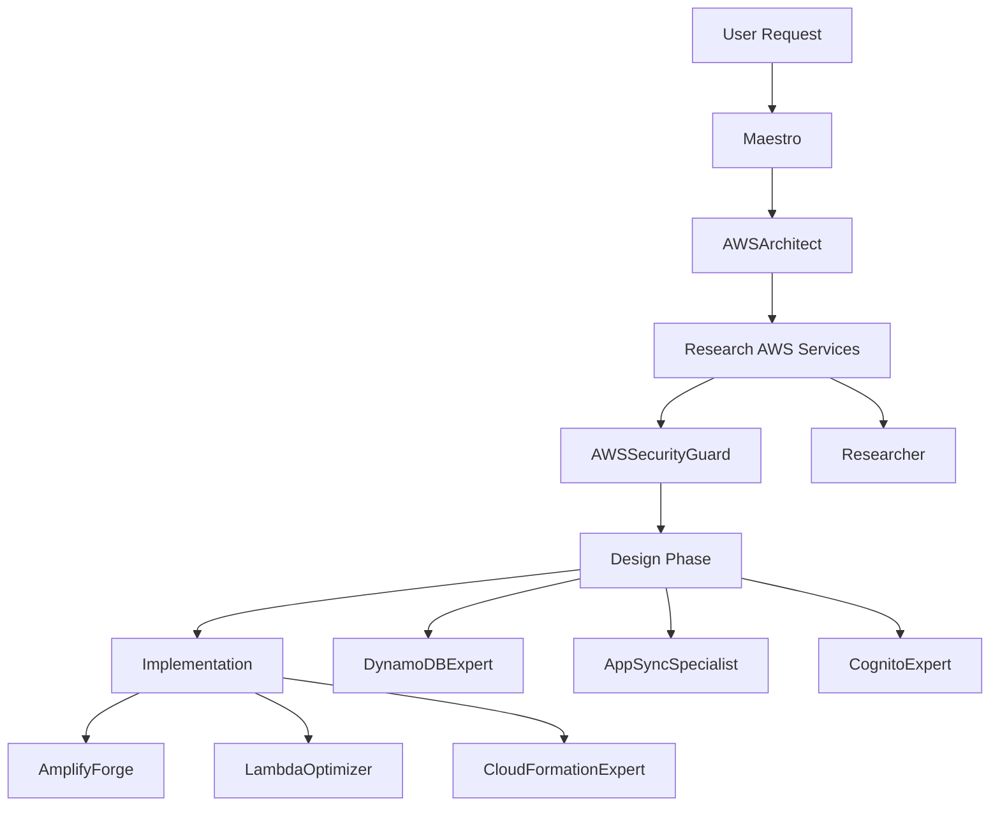
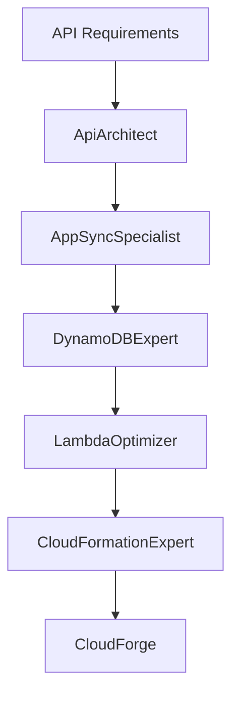
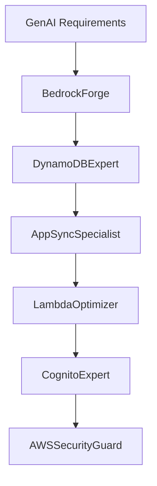
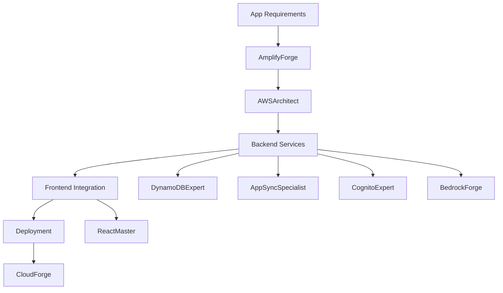

# AWS Mode Set Workflows

## Overview

The AWS Mode Set provides a comprehensive collection of specialized modes for AWS cloud development, focusing on serverless architectures, Amplify Gen 2, and AWS best practices. This document outlines common workflow patterns and collaboration strategies.

## Mode Set Composition

### Core AWS Modes
- **AWSArchitect** - Overall AWS architecture and service selection
- **BedrockForge** - Amazon Bedrock and GenAI implementations
- **AWSSecurityGuard** - AWS security, IAM, and compliance
- **DynamoDBExpert** - DynamoDB design and optimization
- **AppSyncSpecialist** - GraphQL and AppSync development
- **CognitoExpert** - Authentication and user management
- **LambdaOptimizer** - Lambda functions and serverless compute
- **AmplifyForge** - Amplify Gen 2 development
- **CloudFormationExpert** - Infrastructure as code
- **CloudForge** - Cloud deployment and management

### Supporting Modes
- **DataArchitect** - Data modeling and architecture
- **ApiArchitect** - API design and patterns
- **AuthGuardian** - Authentication strategies
- **SecurityStrategist** - Overall security planning
- **Researcher** - Technical research and best practices
- **Documentarian** - Documentation creation
- **ErrorManager** - Error handling and debugging
- **GitMaster** - Version control
- **Maestro** - Workflow orchestration

## Common Workflow Patterns

### 1. New AWS Application Development



**Sequence:**
1. **Architecture Planning** (AWSArchitect)
   - Define overall architecture
   - Select AWS services
   - Plan scalability approach

2. **Security Baseline** (AWSSecurityGuard)
   - IAM policies
   - Security groups
   - Encryption requirements

3. **Service-Specific Design**
   - Database design (DynamoDBExpert)
   - API schema (AppSyncSpecialist)
   - Auth flows (CognitoExpert)

4. **Implementation**
   - Amplify setup (AmplifyForge)
   - Lambda functions (LambdaOptimizer)
   - Infrastructure code (CloudFormationExpert)

### 2. Serverless API Development



**Workflow:**
1. API design and patterns (ApiArchitect)
2. GraphQL schema creation (AppSyncSpecialist)
3. Database design (DynamoDBExpert)
4. Lambda resolver implementation (LambdaOptimizer)
5. Infrastructure as code (CloudFormationExpert)
6. Deployment (CloudForge)

### 3. GenAI Application with RAG



**Process:**
1. Bedrock model selection (BedrockForge)
2. Knowledge base design (DynamoDBExpert)
3. Query API development (AppSyncSpecialist)
4. Processing functions (LambdaOptimizer)
5. User authentication (CognitoExpert)
6. Security review (AWSSecurityGuard)

### 4. Amplify Gen 2 Full-Stack App



**Stages:**
1. Amplify project setup (AmplifyForge)
2. Architecture design (AWSArchitect)
3. Backend configuration
   - Data layer (DynamoDBExpert)
   - API layer (AppSyncSpecialist)
   - Auth layer (CognitoExpert)
   - AI features (BedrockForge)
4. Frontend development (ReactMaster)
5. Deployment pipeline (CloudForge)

## Collaboration Patterns

### Service Integration Flow
```
AWSArchitect → Service Specialists → CloudFormationExpert → CloudForge
     ↓              ↓                      ↓                    ↓
   Design      Implementation         Infrastructure        Deploy
```

### Security Review Cycle
```
Implementation → AWSSecurityGuard → SecurityStrategist → Updates
      ↓                ↓                   ↓               ↓
    Code           IAM Review         Compliance      Remediation
```

### Error Resolution Path
```
Error Detection → ErrorManager → Service Specialist → Resolution
       ↓               ↓               ↓                 ↓
   Logs/Metrics    Analysis      Root Cause          Fix/Update
```

## Best Practices

### 1. Architecture First
- Always start with AWSArchitect for system design
- Get security review early with AWSSecurityGuard
- Research best practices with Researcher

### 2. Service-Specific Expertise
- Use DynamoDBExpert for all DynamoDB designs
- Involve AppSyncSpecialist for GraphQL APIs
- Leverage BedrockForge for AI/ML features

### 3. Infrastructure as Code
- CloudFormationExpert for IaC development
- Version control with GitMaster
- Deploy through CloudForge

### 4. Documentation
- Maintain architecture docs (Documentarian)
- Document APIs and schemas
- Keep runbooks updated

## Mode Selection Guide

| Scenario | Primary Mode | Supporting Modes |
|----------|--------------|------------------|
| New AWS project | AWSArchitect | Researcher, AWSSecurityGuard |
| Database design | DynamoDBExpert | DataArchitect, AWSArchitect |
| API development | AppSyncSpecialist | ApiArchitect, LambdaOptimizer |
| Auth implementation | CognitoExpert | AuthGuardian, AWSSecurityGuard |
| Serverless functions | LambdaOptimizer | CloudFormationExpert |
| GenAI features | BedrockForge | DynamoDBExpert, AppSyncSpecialist |
| Amplify project | AmplifyForge | All service specialists |
| Infrastructure | CloudFormationExpert | CloudForge, AWSArchitect |
| Security review | AWSSecurityGuard | SecurityStrategist |
| Deployment | CloudForge | GitMaster, CloudFormationExpert |

## Integration Points

### 1. Context Files
All modes share context through:
- `/docs/aws/architecture-decisions.md`
- `/docs/aws/service-inventory.md`
- `/docs/aws/security-baseline.md`
- `/docs/project-management/workflow-state.md`

### 2. Handoff Protocols
- Architecture docs from AWSArchitect
- Schema definitions from AppSyncSpecialist
- Security policies from AWSSecurityGuard
- Infrastructure templates from CloudFormationExpert

### 3. Review Cycles
- Architecture review (AWSArchitect)
- Security review (AWSSecurityGuard)
- Code review (CodeReviewer)
- Cost review (AWSArchitect + Researcher)

## Common Tasks

### Setting Up a New Service
1. Delegate to AWSArchitect for service selection
2. Research best practices (Researcher)
3. Security planning (AWSSecurityGuard)
4. Service-specific implementation
5. Infrastructure code (CloudFormationExpert)
6. Deployment (CloudForge)

### Debugging AWS Issues
1. Initial triage (ErrorManager)
2. Service-specific analysis (relevant expert)
3. Root cause identification
4. Solution implementation
5. Documentation update

### Cost Optimization
1. Current state analysis (AWSArchitect)
2. Usage research (Researcher)
3. Optimization opportunities (service experts)
4. Implementation plan
5. Monitoring setup

## Mode Set Activation

To use the AWS mode set:
```
maestro use aws
```

This loads all AWS-specific modes and configures Maestro for AWS development workflows.
