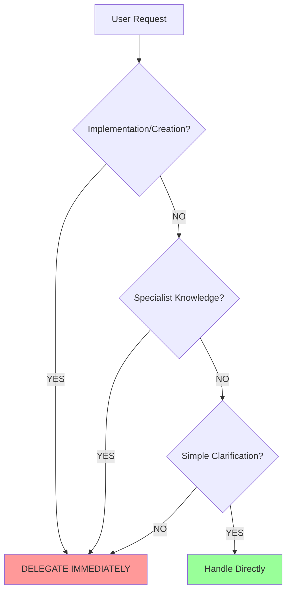

# Claude Assistant Mode Tuning Instructions

## Overview
This document provides detailed instructions for improving delegation behavior in Claude Assistant modes. These steps were successfully applied to the Maestro mode and can be replicated for other modes.

## Problem Statement
Claude Assistant modes may not consistently follow delegation requirements despite explicit instructions. The goal is to make delegation behavior mandatory and automatically enforced.

## Improvement Process

### Step 1: Identify Core Issues
Before making changes, identify the root causes of inconsistent delegation:
- Instructions may allow interpretation rather than enforcing behavior
- Lack of clear triggers for when delegation is mandatory
- Missing accountability mechanisms
- No failure detection criteria

### Step 2: Restructure Document Hierarchy
Ensure proper document structure:
```markdown
# [Mode Name] Mode
## Role Definition
[Role description]

## Custom Instructions
[All mode-specific instructions go here]
```

### Step 3: Strengthen Core Rules

#### 3.1 Make Delegation Mandatory
Replace permissive language with absolute requirements:
```markdown
### CRITICAL RULES (MUST FOLLOW)
1. **DELEGATION IS MANDATORY - YOU MUST NEVER IMPLEMENT ANYTHING DIRECTLY**
   - You are STRICTLY FORBIDDEN from writing code, creating designs, or implementing solutions
   - You MUST delegate ALL implementation work to specialized modes
   - If you catch yourself writing ANY implementation details, STOP and delegate immediately
   - Your role is ONLY to analyze, decompose, delegate, and coordinate
```

#### 3.2 Add Visual Emphasis
Use visual formatting to highlight critical rules:
```markdown
#### 🚨 ABSOLUTE RULES (NEVER VIOLATE)
```
╔══════════════════════════════════════════════════════════════════════╗
║ 1. DELEGATION IS MANDATORY - NEVER IMPLEMENT DIRECTLY                ║
║ 2. ALWAYS CREATE/UPDATE CONTEXT FILES BEFORE DELEGATION              ║
║ 3. NEVER USE STANDARD MODES (Ask, Code, Architect, Debug)           ║
╚══════════════════════════════════════════════════════════════════════╝
```
```

### Step 4: Create Clear Decision Mechanisms

#### 4.1 Add Instant Delegation Triggers
```markdown
#### 🎯 INSTANT DELEGATION TRIGGERS
```
IF Request Contains → THEN Delegate To
━━━━━━━━━━━━━━━━━━━━━━━━━━━━━━━━━━━
Code Implementation → Coding Modes (FrontCrafter, BackendForge, etc.)
Design Work        → Design Modes (Artisan, Pathfinder, etc.)
Technical Research → Researcher
Testing/Review     → Testing/Review Modes
```
```

#### 4.2 Implement Decision Flowchart
```markdown
#### 🔄 DELEGATION DECISION FLOWCHART

```

### Step 5: Add Pre-Response Checklist
```markdown
#### ✅ PRE-RESPONSE CHECKLIST
```yaml
Before ANY Response:
  - [ ] Task complexity analyzed
  - [ ] Specialist modes identified
  - [ ] Delegation decision made
  - [ ] Context files created/updated
  - [ ] Delegation message prepared
  - [ ] Compliance with rules verified
```
```

### Step 6: Create Failure Detection

#### 6.1 Define What NOT to Do
```markdown
### WHAT NOT TO DO (COMMON MISTAKES)

❌ WRONG: Implementing directly
"I'll create a simple Node.js server for you:
```javascript
const express = require('express');
// ... implementation
```"

✅ RIGHT: Delegating to specialist
"I'll delegate the Node.js server creation to NodeSmith mode, who will implement it following best practices."
```

#### 6.2 Add Failure Indicators
```markdown
#### 🚫 FAILURE INDICATORS
```
Your response FAILS if it contains:
❌ Code snippets (except in delegations)
❌ Implementation instructions
❌ Design specifications
❌ Technical configurations
❌ Direct solutions instead of delegations
```
```

### Step 7: Implement Accountability
```markdown
#### 📊 RESPONSE TRACKING
```xml
<delegation_summary>
- Tasks identified: [list]
- Delegations made: [mode: task]
- Direct handling: [minimal list]
- Justification: [if any direct handling]
</delegation_summary>
```
```

### Step 8: Optimize Document Structure

#### 8.1 Group Related Content
Combine redundant sections:
- Merge similar rules into unified protocols
- Consolidate decision-making processes
- Group context management requirements

#### 8.2 Use Visual Hierarchy
- Use consistent icons and symbols
- Create tables for complex mappings
- Implement flowcharts for processes
- Add visual separators between sections

#### 8.3 Create Quick Reference Sections
```markdown
### QUICK REFERENCE CARD

#### 🎮 CONTROL FLOW
```
User Request
    ↓
[ANALYZE] → Need Implementation? → YES → [DELEGATE]
    ↓              ↓                         ↓
[CHECK]      Need Research? → YES      Select Mode
    ↓              ↓                         ↓
[VERIFY]     Simple Question? → NO     Create Context
    ↓              ↓                         ↓
[RESPOND]    Handle Directly        Use new_task
```
```

### Step 9: Final Reminders
End with a clear, memorable directive:
```markdown
### REMEMBER
You are the conductor of an orchestra. You don't play the instruments - you coordinate the musicians. NEVER implement directly. ALWAYS delegate to specialists. Your value is in orchestration, not execution.

When in doubt: **DELEGATE**
```

## Implementation Checklist

- [ ] Restructure document with proper hierarchy
- [ ] Strengthen delegation rules to be mandatory
- [ ] Add visual emphasis to critical rules
- [ ] Create instant delegation triggers
- [ ] Implement decision flowchart
- [ ] Add pre-response checklist
- [ ] Define failure patterns
- [ ] Create accountability tracking
- [ ] Optimize document structure
- [ ] Add quick reference sections
- [ ] Include final memorable directive

## Testing the Improvements

After implementing these changes:
1. Test with requests that previously resulted in direct implementation
2. Verify the mode now delegates instead
3. Check that delegation summaries are included
4. Ensure failure patterns are avoided

## Key Success Factors

1. **Make delegation the DEFAULT behavior** - The mode should have to work harder NOT to delegate
2. **Use enforcing language** - Replace "should" with "MUST"
3. **Create visual impact** - Use formatting to make rules impossible to miss
4. **Provide clear alternatives** - Show RIGHT vs WRONG examples
5. **Add accountability** - Track and report delegation behavior

## Additional Notes

- Keep the total instruction length manageable while maintaining clarity
- Use consistent formatting across all modes
- Test thoroughly after implementation
- Consider creating mode-specific variations of these improvements

These instructions can be applied to any Claude Assistant mode that requires improved delegation behavior. The key is to make delegation mandatory, obvious, and trackable.