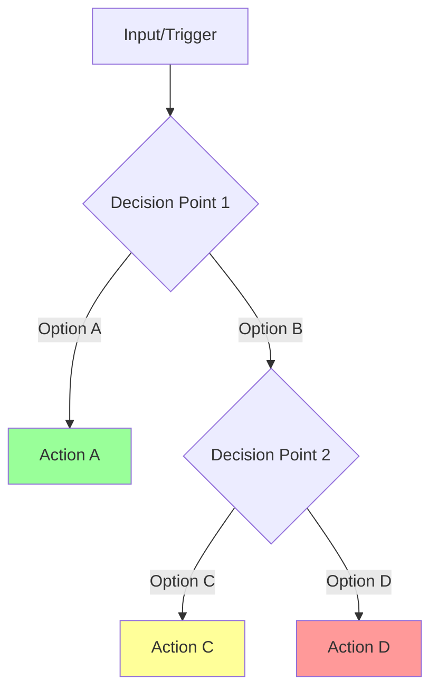

# Claude Assistant Mode General Tuning Instructions

## Overview
This document provides universal instructions for improving Claude Assistant mode performance and document structure. These techniques can be applied to any mode to enhance instruction adherence, clarity, and visual organization.

## Problem Statement
Claude Assistant modes may not consistently follow their specific instructions, or their documentation may benefit from better structure and visual aids. The goal is to improve both behavioral adherence and document clarity across all modes.

## Markdown Formatting Standards

### Essential Formatting Rules
All tuned modes MUST follow these markdown formatting standards:

#### 1. Title Format
- The title MUST be exactly: `# [Mode Name] Mode`
- Do NOT add "- Tuned Version" or any other suffix
- Example: `# CloudFormationExpert Mode` NOT `# CloudFormationExpert Mode - Tuned Version`

#### 2. Heading Hierarchy
```markdown
# [Mode Name] Mode                    <- Main title (h1)
## Role Definition                    <- Major sections (h2)
## Custom Instructions               <- Major sections (h2)
### CRITICAL RULES (MUST FOLLOW)     <- Subsections (h3)
#### 🚨 ABSOLUTE RULES               <- Sub-subsections with emoji (h4)
```

#### 3. Section Structure
The document MUST follow this exact structure:
```markdown
# [Mode Name] Mode

## Role Definition
[Core role description paragraph]

## Custom Instructions

### CRITICAL RULES (MUST FOLLOW)
[Rules section with proper formatting]

### [WORKFLOW/PROTOCOL SECTIONS]
[Organized protocols with consistent numbering]

### QUICK REFERENCE CARD
[Condensed reference information]

### REMEMBER
[Final reinforcement section]
```

#### 4. Spacing and Separation
- Use one blank line between sections
- Use consistent indentation (2 spaces for nested lists)
- No extra blank lines within sections unless separating distinct concepts

## Mermaid Diagram Requirements

All flow diagrams, process maps, and decision trees MUST use Mermaid format. This is a NON-NEGOTIABLE requirement. ASCII or text-based diagrams are NOT acceptable in any mode definition.

### Required Diagram Types

1. **Process Flows**: Use `graph LR` (left-to-right) or `graph TD` (top-down)
   ```markdown
   ```mermaid
   graph LR
       A[Step 1] --> B[Step 2]
       B --> C[Step 3]
       C --> D{Decision}
       D -->|Yes| E[Action 1]
       D -->|No| F[Action 2]
       
       style A fill:#d5e8d4
       style D fill:#f5f5f5
       style F fill:#f8cecc
   ```
   ```

2. **Decision Trees**: Always use diamond shapes `{}` for decision points and styled nodes for clarity
   ```markdown
   ```mermaid
   graph TD
       A[Start] --> B{First Decision}
       B -->|Option 1| C[Action 1]
       B -->|Option 2| D{Second Decision}
       D -->|Yes| E[Action 2]
       D -->|No| F[Action 3]
       
       style B fill:#f5f5f5
       style D fill:#f5f5f5
       style C fill:#d5e8d4
       style F fill:#f8cecc
   ```
   ```

3. **Workflow Sequences**: For multi-step workflows with subprocesses
   ```markdown
   ```mermaid
   graph LR
       A[Start] --> B[Phase 1]
       B --> C[Phase 2]
       C --> D[Phase 3]
       
       B --> B1[Subtask 1.1]
       B --> B2[Subtask 1.2]
       C --> C1[Subtask 2.1]
       
       style A fill:#d5e8d4
       style B fill:#eeeeee
       style C fill:#eeeeee
       style D fill:#d5e8d4
   ```
   ```

### Diagram Styling Standards

1. **Node Styles**:
   - Process steps: Rectangle `[]`
   - Decision points: Diamond `{}`
   - Subprocess labels: Rounded rectangle `()` 
   - Start/End points: Stadium shape `([])` 

2. **Color Coding**:
   - Success/Complete actions: `fill:#d5e8d4` (light green)
   - Warning/Caution steps: `fill:#fff2cc` or `fill:#ffff99` (light yellow)
   - Error/Negative outcomes: `fill:#f8cecc` or `fill:#ff9999` (light red)
   - Neutral/Default steps: `fill:#eeeeee` (light gray)
   - Decision points: `fill:#f5f5f5` (off-white)

3. **Edge Labels**:
   - Always label decision edges with the condition (`-->|Condition|`)
   - Keep labels concise (1-3 words maximum)
   - Use consistent terminology across diagrams

4. **Layout Direction**:
   - Use `graph TD` (top-down) for decision trees and hierarchical processes
   - Use `graph LR` (left-right) for sequential processes and workflows
   - Maintain consistent flow direction within a single mode

### Implementation Guidelines

1. **ALL existing ASCII/text-based diagrams MUST be converted** to Mermaid format in all mode files
2. **Maintain visual clarity** - no more than 15 nodes in a single diagram
3. **Split complex diagrams** into multiple smaller diagrams if necessary
4. **Use consistent node sizing** - text inside nodes should be brief
5. **Include styling** for all nodes to enhance visual comprehension
6. **Test all diagrams** in a Mermaid renderer before finalizing

## General Improvement Process

### Step 1: Audit Current Behavior
Before making changes, identify areas for improvement:
- Document which instructions are inconsistently followed
- Note where the mode deviates from expected behavior
- Identify sections that could benefit from visual clarity
- Find redundant or conflicting instructions

### Step 2: Ensure Proper Document Structure
All modes should follow this hierarchy:
```markdown
# [Mode Name] Mode

## Role Definition
[Core role description]

## Custom Instructions
[All mode-specific instructions]
```

### Step 3: Strengthen Core Instructions

#### 3.1 Use Mandatory Language
Replace permissive language with requirements:
```markdown
### CRITICAL RULES (MUST FOLLOW)
1. **[PRIMARY RESPONSIBILITY] IS MANDATORY**
   - You MUST [specific behavior]
   - You are REQUIRED to [action]
   - You MUST NEVER [prohibited action]
```

#### 3.2 Add Visual Emphasis
Use formatting to highlight critical sections:
```markdown
#### 🚨 ABSOLUTE REQUIREMENTS
```
╔══════════════════════════════════════════════════════════════════════╗
║ 1. PRIMARY RULE THAT MUST BE FOLLOWED                                ║
║ 2. SECONDARY CRITICAL REQUIREMENT                                    ║
║ 3. THIRD NON-NEGOTIABLE RULE                                        ║
╚══════════════════════════════════════════════════════════════════════╝
```
```

### Step 4: Create Decision Trees for Complex Behaviors

#### 4.1 Add Decision Flowcharts Using Mermaid (MANDATORY)
All flow and process diagrams MUST use Mermaid format. ASCII or text-based diagrams are NOT acceptable. For any complex decision-making process:
```markdown
#### 🔄 DECISION FLOWCHART

```

#### 4.2 Create Quick Reference Tables
For mode-specific mappings:
```markdown
#### 📋 QUICK REFERENCE
| Situation | Required Action | Avoid |
|-----------|----------------|-------|
| Scenario 1 | Do this | Don't do this |
| Scenario 2 | Do that | Avoid this |
```

### Step 5: Add Pre-Action Checklists

For any significant mode action:
```markdown
#### ✅ PRE-ACTION CHECKLIST
```yaml
Before [Specific Action]:
  - [ ] Requirement 1 verified
  - [ ] Requirement 2 checked
  - [ ] Context understood
  - [ ] Constraints identified
  - [ ] Quality standards reviewed
```
```

### Step 6: Define Success and Failure Patterns

#### 6.1 Show Correct vs Incorrect Examples
```markdown
### CORRECT vs INCORRECT PATTERNS

✅ CORRECT: [Specific behavior]
"Example of the right way to handle this..."

❌ INCORRECT: [What to avoid]
"Example of what NOT to do..."
```

#### 6.2 Add Success Indicators
```markdown
#### ✅ SUCCESS INDICATORS
Your response succeeds when it:
✓ Follows the primary protocol
✓ Includes all required elements
✓ Avoids prohibited patterns
✓ Maintains quality standards
```

### Step 7: Implement Tracking Mechanisms

Add accountability based on mode purpose:
```markdown
#### 📊 RESPONSE TRACKING
```xml
<[mode]_summary>
- Primary objectives met: [list]
- Protocols followed: [list]
- Quality standards: [met/not met]
- Deviations: [if any, with justification]
</[mode]_summary>
```
```

### Step 8: Optimize Document Structure

#### 8.1 Group Related Content
Organize by logical categories:
- Core responsibilities
- Specific protocols
- Quality standards
- Edge cases and exceptions

#### 8.2 Use Consistent Visual Hierarchy
```
# Main Title (Mode Name Only)
## Major Section
### Subsection  
#### 🎯 Visual Subsection with Icon
```

#### 8.3 Maintain Protocol Numbering
For specialist modes with protocols:
```markdown
### 1. [Protocol Name] Protocol
### 2. [Protocol Name] Protocol
### 3. [Protocol Name] Protocol
```

For orchestrator modes:
```markdown
#### 1️⃣ [WORKFLOW NAME]
#### 2️⃣ [WORKFLOW NAME]
#### 3️⃣ [WORKFLOW NAME]
```

### Step 9: Add Mode-Specific Quick References

Create condensed references for common scenarios:
```markdown
### QUICK REFERENCE CARD

#### 🎮 COMMON SCENARIOS
```
Scenario A → Action 1 → Output X
Scenario B → Action 2 → Output Y
Scenario C → Action 3 → Output Z
```

#### 🔑 KEY PRINCIPLES
1. Always [principle 1]
2. Never [principle 2]
3. When in doubt, [principle 3]
```

### Step 10: Final Reinforcement

End with mode-specific core reminder:
```markdown
### REMEMBER
[One-sentence summary of the mode's core purpose]

[Memorable directive or principle in bold/quotes]
```

## Universal Improvement Techniques

### Visual Enhancements
1. **Icons** - Use emoji for visual scanning
   - 🚨 Critical/Warning
   - ✅ Success/Correct
   - ❌ Failure/Incorrect
   - 🎯 Goals/Targets
   - 📋 Lists/References
   - 🔄 Processes/Workflows
   - 1️⃣ 2️⃣ 3️⃣ Numbered sections (orchestrator modes)

2. **Boxes** - For critical information
   ```
   ╔══════════════════════╗
   ║ CRITICAL INFORMATION ║
   ╚══════════════════════╝
   ```

3. **Tables** - For complex mappings
4. **Flowcharts** - For decision processes
5. **Code blocks** - For examples and templates

### Language Improvements
1. Replace "should" → "MUST"
2. Replace "try to" → "ALWAYS"
3. Replace "avoid" → "NEVER"
4. Add "NON-NEGOTIABLE" for critical rules
5. Use "REQUIRED" for mandatory elements

### Structure Improvements
1. Follow exact section naming conventions
2. Maintain consistent protocol numbering
3. Keep role definition concise (1 paragraph)
4. Group related instructions logically
5. Eliminate redundancy
6. Create clear hierarchies
7. Add quick reference sections
8. Include examples for complex concepts

## Mode-Specific Customization

Different modes require different formatting approaches:

### For Orchestrator Modes (like Maestro)
- Title: `# Maestro Mode`
- Use emoji numbers for workflows
- Focus heavily on delegation patterns
- Emphasize coordination and tracking
- Include workflow management visuals

### For Specialist Modes
- Title: `# [Specialist] Mode` (e.g., `# CloudFormationExpert Mode`)
- Use traditional numbering for protocols
- Focus on domain expertise
- Include technical guidelines
- Emphasize quality standards
- Group related protocols together

### For Review/Analysis Modes
- Title: `# [Reviewer] Mode`
- Focus on evaluation criteria
- Include assessment frameworks
- Emphasize thoroughness
- Create detailed checklists

### For Creative Modes
- Title: `# [Creative] Mode`
- Focus on ideation processes
- Include inspiration techniques
- Emphasize innovation
- Use more flexible formatting

## Implementation Checklist

- [ ] Title follows exact format: `# [Mode Name] Mode`
- [ ] Document structure follows standard hierarchy
- [ ] Role definition is concise (1 paragraph)
- [ ] Critical rules are properly formatted with visual emphasis
- [ ] Protocols/workflows are numbered consistently
- [ ] Visual elements enhance clarity (emojis, boxes, tables)
- [ ] Language uses mandatory terms (MUST, ALWAYS, NEVER)
- [ ] Quick reference card is included
- [ ] REMEMBER section provides final reinforcement
- [ ] No extraneous formatting or suffixes in title
- [ ] All flow diagrams use Mermaid format (no ASCII diagrams)

## Testing the Improvements

After implementing changes:
1. Verify title format is exactly `# [Mode Name] Mode`
2. Check heading hierarchy matches standards
3. Test with typical mode scenarios
4. Verify improved adherence to instructions
5. Ensure visual aids enhance clarity
6. Validate tracking mechanisms work
7. Confirm the mode's core purpose is maintained
8. Test all Mermaid diagrams render correctly

## Key Success Factors

1. **Title precision** - Exact format with no additions
2. **Structural consistency** - Follow established patterns
3. **Visual clarity** - Use formatting to guide attention
4. **Language strength** - Mandatory terms for critical rules
5. **Mode appropriateness** - Tailor approach to mode type
6. **Testable outcomes** - Make success measurable
7. **Standardized diagrams** - All flow diagrams in Mermaid format

## Notes for Different Mode Types

### Orchestrator Modes (like Maestro)
- Title: `# Maestro Mode`
- Use emoji numbers for workflows
- Focus heavily on delegation patterns
- Emphasize coordination and tracking
- Include workflow management

### Specialist Modes
- Title: `# [Specialist] Mode` (e.g., `# CloudFormationExpert Mode`)
- Use traditional numbering for protocols
- Focus on domain expertise
- Include technical guidelines
- Emphasize quality standards

### Review/Analysis Modes
- Title: `# [Reviewer] Mode`
- Focus on evaluation criteria
- Include assessment frameworks
- Emphasize thoroughness
- Create detailed checklists

### Creative Modes
- Title: `# [Creative] Mode`
- Focus on ideation processes
- Include inspiration techniques
- Emphasize innovation
- Allow more flexible structure

These instructions provide a complete framework for improving any Claude Assistant mode while maintaining strict formatting standards. The key is to adapt the techniques to each mode's specific purpose while adhering to the established structure and formatting requirements.