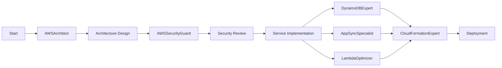

# AWS Mode Set User Guide

## Overview

The AWS Mode Set is a comprehensive collection of specialized AI assistants designed to help developers build, deploy, and maintain applications on Amazon Web Services. This guide provides detailed instructions on how to effectively use these modes for AWS development projects.

## Getting Started

### Prerequisites

1. **Enable MCP Servers**
   - Ensure all AWS-related MCP servers are enabled in your Cline settings
   - Required servers:
     - `awslabs-core-mcp-server`
     - `awslabs-cdk-mcp-server`
     - `awslabs.aws-documentation-mcp-server`
     - `awslabs.aws-diagram-mcp-server`
     - `awslabs.aws-pricing-mcp-server`
     - `unirt.amplify-doc-mcp-server`
     - `awslabs.aws-knowledgebases`

2. **Project Setup**
   - Initialize your AWS project in a local directory
   - Ensure AWS CLI is configured with appropriate credentials
   - Have AWS account information ready

### Activating the AWS Mode Set

To use the AWS mode set, delegate tasks to Maestro with the AWS context:

```
@Maestro "I need to build a serverless API with DynamoDB" --context aws
```

Maestro will automatically select appropriate AWS modes for your task.

## Available AWS Modes

### Core Architecture Modes

#### AWSArchitect
**Purpose**: Overall AWS architecture design and service selection

**When to Use**:
- Starting a new AWS project
- Designing system architecture
- Selecting appropriate AWS services
- Planning for scalability and reliability

**Example Usage**:
```
@Maestro "Design a scalable e-commerce platform architecture using AWS services"
```

#### BedrockForge
**Purpose**: Amazon Bedrock and GenAI implementations

**When to Use**:
- Building AI-powered applications
- Implementing RAG patterns
- Working with foundation models
- Creating conversational interfaces

**Example Usage**:
```
@Maestro "Create a document Q&A system using Bedrock and knowledge bases"
```

#### AWSSecurityGuard
**Purpose**: AWS security, IAM, and compliance

**When to Use**:
- Setting up IAM policies
- Implementing security best practices
- Compliance requirements
- Security reviews

**Example Usage**:
```
@Maestro "Review and secure my Lambda function IAM roles"
```

### Data and API Modes

#### DynamoDBExpert
**Purpose**: DynamoDB design and optimization

**When to Use**:
- Designing DynamoDB tables
- Implementing single-table design
- Optimizing query patterns
- Troubleshooting performance issues

**Example Usage**:
```
@Maestro "Design a DynamoDB schema for a multi-tenant SaaS application"
```

#### AppSyncSpecialist
**Purpose**: GraphQL and AppSync development

**When to Use**:
- Creating GraphQL APIs
- Designing schemas
- Implementing resolvers
- Real-time subscriptions

**Example Usage**:
```
@Maestro "Create a GraphQL API for a chat application with real-time updates"
```

#### CognitoExpert
**Purpose**: Authentication and user management

**When to Use**:
- Setting up user authentication
- Implementing MFA
- Social identity providers
- User pool configuration

**Example Usage**:
```
@Maestro "Set up Cognito with Google and Facebook login for my app"
```

### Infrastructure and Deployment

#### CloudFormationExpert
**Purpose**: Infrastructure as code with CloudFormation/CDK

**When to Use**:
- Writing CloudFormation templates
- CDK development
- Infrastructure deployment
- Stack troubleshooting

**Example Usage**:
```
@Maestro "Create a CDK stack for a three-tier web application"
```

#### LambdaOptimizer
**Purpose**: Lambda function optimization

**When to Use**:
- Writing Lambda functions
- Optimizing cold starts
- Lambda layer management
- Performance tuning

**Example Usage**:
```
@Maestro "Optimize my Lambda function for cold start performance"
```

#### AmplifyForge
**Purpose**: AWS Amplify Gen 2 development

**When to Use**:
- Building Amplify applications
- Frontend/backend integration
- Amplify hosting
- CI/CD setup

**Example Usage**:
```
@Maestro "Set up an Amplify Gen 2 project with React and authentication"
```

## Common Workflows

### 1. Building a New Application



**Step-by-Step Process**:

1. **Start with Architecture**
   ```
   @Maestro "Design architecture for a real-time analytics platform"
   ```

2. **Security Planning**
   ```
   @Maestro "Review security requirements and create IAM policies"
   ```

3. **Data Layer Design**
   ```
   @Maestro "Design DynamoDB tables for storing analytics data"
   ```

4. **API Development**
   ```
   @Maestro "Create GraphQL API for analytics dashboard"
   ```

5. **Compute Layer**
   ```
   @Maestro "Implement Lambda functions for data processing"
   ```

6. **Infrastructure as Code**
   ```
   @Maestro "Create CDK stack for the entire application"
   ```

### 2. Adding AI Features

**Workflow**:
1. Requirements gathering with AWSArchitect
2. AI implementation with BedrockForge
3. Integration with existing services
4. Security review with AWSSecurityGuard

**Example**:
```
@Maestro "Add a chatbot to my e-commerce site using Bedrock"
```

### 3. Performance Optimization

**Workflow**:
1. Performance analysis with appropriate service expert
2. Optimization recommendations
3. Implementation of improvements
4. Testing and validation

**Example**:
```
@Maestro "My DynamoDB queries are slow, help me optimize them"
```

## Best Practices

### 1. Mode Selection

- Always start with AWSArchitect for new projects
- Use service-specific experts for detailed implementation
- Involve AWSSecurityGuard early and often
- Let Maestro coordinate between modes

### 2. Context Management

The AWS modes share context through several key files:
- `/docs/aws/architecture-decisions.md`
- `/docs/aws/service-inventory.md`
- `/docs/aws/security-baseline.md`
- `/docs/aws/cost-analysis.md`

These files are automatically maintained by the modes.

### 3. Iterative Development

1. Start with high-level design
2. Implement core features
3. Add security and optimization
4. Review and refine
5. Document decisions

### 4. Documentation

- Architecture decisions are documented automatically
- Keep service inventory updated
- Document security policies
- Track cost implications

## Advanced Usage

### Custom Workflows

Create custom workflows for your specific needs:

```
@Maestro "Create a custom workflow for deploying microservices with automatic scaling"
```

### Multi-Region Deployments

```
@Maestro "Design a multi-region deployment strategy for my application"
```

### Cost Optimization

```
@Maestro "Analyze my AWS architecture and suggest cost optimizations"
```

### Compliance Requirements

```
@Maestro "Ensure my architecture meets HIPAA compliance requirements"
```

## Troubleshooting with AWS Modes

### Common Issues

1. **Service Limits**
   ```
   @Maestro "I'm hitting DynamoDB throttling limits, how do I fix this?"
   ```

2. **Performance Problems**
   ```
   @Maestro "My Lambda functions have high cold start latency"
   ```

3. **Security Concerns**
   ```
   @Maestro "Review my S3 bucket permissions for security issues"
   ```

4. **Cost Overruns**
   ```
   @Maestro "My AWS bill is too high, help me identify cost savings"
   ```

### Getting Help

If you're unsure which mode to use:
```
@Maestro "I need help with AWS but I'm not sure where to start"
```

Maestro will guide you to the appropriate mode.

## Integration with Existing Tools

### CDK Projects
```
@Maestro "Integrate my existing CDK project with the AWS mode set"
```

### Terraform Users
```
@Maestro "I use Terraform, how do I work with CloudFormationExpert?"
```

### CI/CD Pipelines
```
@Maestro "Set up CI/CD for my AWS application"
```

## Tips and Tricks

### 1. Efficient Mode Usage

- Be specific in your requests
- Provide context about your project
- Share relevant code or configurations
- Ask for explanations when needed

### 2. Learning and Documentation

- Request educational explanations
- Ask for best practices
- Request documentation updates
- Learn AWS patterns through examples

### 3. Collaboration

- Modes work together automatically
- Context is shared between modes
- Handoffs are managed by Maestro
- Results are consolidated

## Example Projects

### 1. Serverless REST API

```
@Maestro "Build a serverless REST API with user authentication, DynamoDB backend, and automatic scaling"
```

This will involve:
- AWSArchitect for design
- DynamoDBExpert for data modeling
- LambdaOptimizer for functions
- AppSyncSpecialist or ApiArchitect for API
- CognitoExpert for authentication
- CloudFormationExpert for deployment

### 2. Real-Time Chat Application

```
@Maestro "Create a real-time chat application using AWS services"
```

Involves:
- AWSArchitect for architecture
- AppSyncSpecialist for real-time API
- DynamoDBExpert for message storage
- CognitoExpert for user management
- AmplifyForge for frontend

### 3. AI-Powered Document Analysis

```
@Maestro "Build a document analysis system using Bedrock"
```

Uses:
- BedrockForge for AI implementation
- S3 for document storage
- LambdaOptimizer for processing
- AppSyncSpecialist for API
- CloudFormationExpert for infrastructure

## Mode Interaction Examples

### Sequential Workflow

When building a feature, modes typically interact in sequence:

```
User Request → Maestro → AWSArchitect → DynamoDBExpert → LambdaOptimizer → CloudFormationExpert
```

### Parallel Workflow

For complex features, modes may work in parallel:

```
                    ┌→ DynamoDBExpert
User Request → Maestro → AWSArchitect ┼→ AppSyncSpecialist
                    └→ LambdaOptimizer
```

### Review Workflow

Security and optimization reviews happen throughout:

```
Implementation → AWSSecurityGuard → Optimization → Testing → Deployment
```

## Frequently Asked Questions

### Q: How do I know which mode to use?

A: Start with Maestro - it will automatically select the right mode. For specific tasks:
- Architecture/design → AWSArchitect
- Database → DynamoDBExpert
- API → AppSyncSpecialist
- Security → AWSSecurityGuard
- AI/ML → BedrockForge

### Q: Can modes work on existing projects?

A: Yes! Modes can analyze existing code, suggest improvements, and add new features to established projects.

### Q: How do modes handle AWS best practices?

A: Each mode is trained on AWS best practices and will automatically apply them. AWSArchitect ensures Well-Architected Framework compliance.

### Q: What about AWS costs?

A: Modes consider cost implications and can provide cost analysis. Use AWSArchitect for cost optimization strategies.

### Q: Can I use modes for troubleshooting?

A: Absolutely! Each mode can help debug issues within its domain. Use ErrorManager for general troubleshooting coordination.

## Mode-Specific Tips

### AWSArchitect Tips
- Provide clear requirements
- Specify non-functional requirements
- Mention compliance needs
- Ask for trade-off analysis

### DynamoDBExpert Tips
- Share access patterns
- Provide data volume estimates
- Mention consistency requirements
- Ask about cost implications

### AppSyncSpecialist Tips
- Define your data model
- Specify real-time needs
- Mention authorization requirements
- Provide example queries

### BedrockForge Tips
- Describe AI use cases clearly
- Mention performance requirements
- Specify data privacy needs
- Ask about model selection

### LambdaOptimizer Tips
- Share current performance metrics
- Mention memory/timeout constraints
- Provide code samples
- Ask about cold start optimization

## Advanced Patterns

### 1. Multi-Account Strategy

```
@Maestro "Design a multi-account AWS strategy for our organization"
```

### 2. Event-Driven Architecture

```
@Maestro "Implement an event-driven architecture using EventBridge"
```

### 3. Data Lake Architecture

```
@Maestro "Design a data lake using S3, Glue, and Athena"
```

### 4. Disaster Recovery

```
@Maestro "Create a disaster recovery plan for my application"
```

## Mode Capabilities Reference

| Mode | Primary Skills | Best For |
|------|----------------|----------|
| AWSArchitect | System design, service selection, Well-Architected Framework | Overall architecture |
| BedrockForge | GenAI, RAG, foundation models | AI/ML features |
| AWSSecurityGuard | IAM, security best practices, compliance | Security implementation |
| DynamoDBExpert | NoSQL design, query optimization, scaling | Database layer |
| AppSyncSpecialist | GraphQL, real-time APIs, resolvers | API development |
| CognitoExpert | Authentication, user pools, federation | User management |
| LambdaOptimizer | Serverless functions, performance, layers | Compute optimization |
| CloudFormationExpert | IaC, CDK, CloudFormation | Infrastructure deployment |
| AmplifyForge | Full-stack development, hosting, CI/CD | Amplify applications |

## Conclusion

The AWS Mode Set provides comprehensive coverage for AWS development needs. By understanding each mode's strengths and how they work together, you can efficiently build robust, scalable, and secure AWS applications.

Remember:
- Let Maestro coordinate between modes
- Start with architecture, then implement details
- Security should be considered throughout
- Documentation is maintained automatically
- Modes share context for seamless collaboration

For additional help or specific use cases not covered in this guide:
```
@Maestro "I need help with [your specific AWS challenge]"
```
