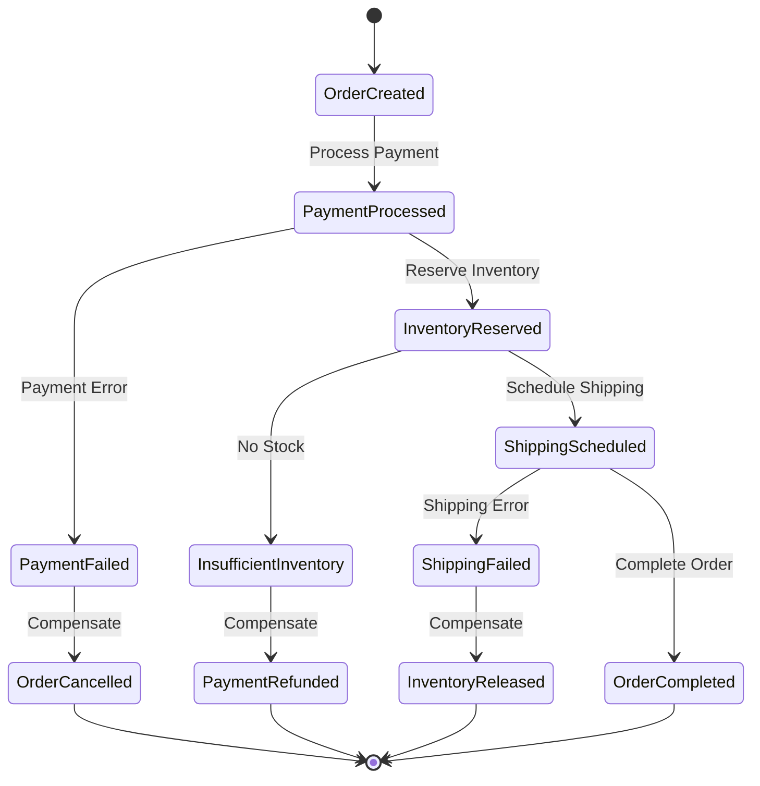
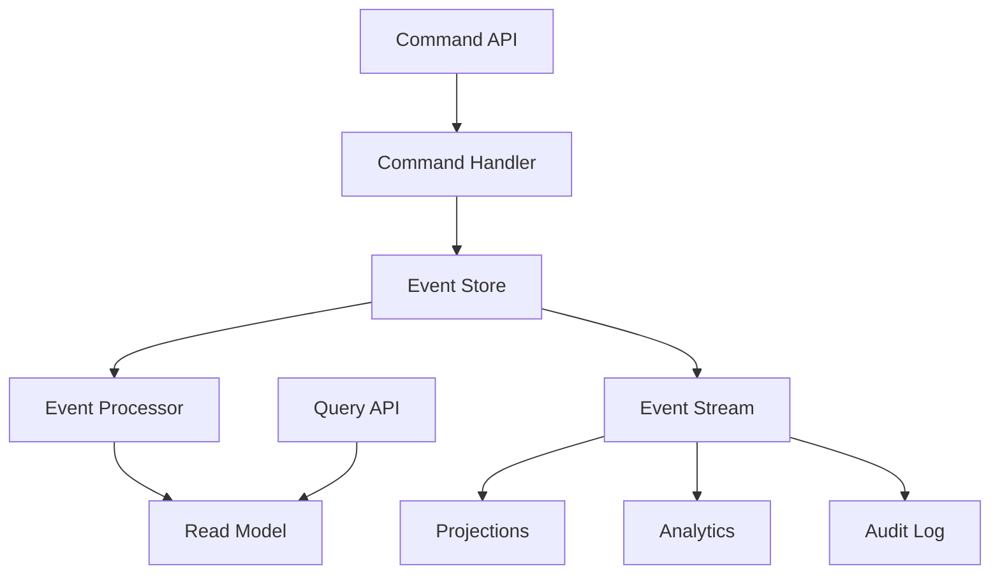
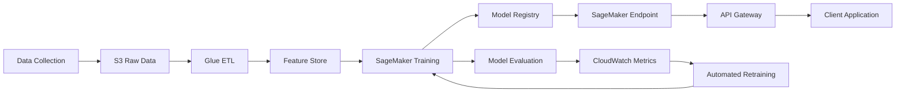

# AWS Mode Set Example Workflows (Continued)

### 2. Monitoring and Observability

Implement comprehensive monitoring:

```javascript
// Custom CloudWatch metrics
const cloudwatch = new AWS.CloudWatch();

async function recordMetric(metricName, value, unit = 'Count') {
  await cloudwatch.putMetricData({
    Namespace: 'MyApp/Workflow',
    MetricData: [{
      MetricName: metricName,
      Value: value,
      Unit: unit,
      Timestamp: new Date(),
      Dimensions: [
        { Name: 'Environment', Value: process.env.ENVIRONMENT },
        { Name: 'WorkflowType', Value: 'VideoProcessing' }
      ]
    }]
  }).promise();
}

// X-Ray tracing
const AWSXRay = require('aws-xray-sdk-core');
const AWS = AWSXRay.captureAWS(require('aws-sdk'));

exports.handler = async (event) => {
  const segment = AWSXRay.getSegment();
  const subsegment = segment.addNewSubsegment('ProcessVideo');
  
  try {
    subsegment.addAnnotation('videoId', event.videoId);
    subsegment.addMetadata('input', event);
    
    const result = await processVideo(event);
    
    subsegment.addMetadata('result', result);
    subsegment.close();
    
    return result;
  } catch (error) {
    subsegment.addError(error);
    subsegment.close();
    throw error;
  }
};
```

### 3. Cost Optimization

Implement cost-aware patterns:

```python
# Use S3 lifecycle policies
lifecycle_policy = {
    'Rules': [{
        'ID': 'ArchiveOldVideos',
        'Status': 'Enabled',
        'Transitions': [
            {
                'Days': 30,
                'StorageClass': 'STANDARD_IA'
            },
            {
                'Days': 90,
                'StorageClass': 'GLACIER'
            }
        ]
    }]
}

# Use DynamoDB on-demand for variable workloads
table = dynamodb.create_table(
    TableName='Videos',
    BillingMode='PAY_PER_REQUEST',
    PointInTimeRecoverySpecification={'PointInTimeRecoveryEnabled': True}
)

# Implement caching to reduce API calls
from functools import lru_cache

@lru_cache(maxsize=100)
def get_video_metadata(video_id):
    return dynamodb.get_item(
        TableName='Videos',
        Key={'VideoId': {'S': video_id}}
    )['Item']
```

### 4. Security Best Practices

Implement security at every layer:

```typescript
// Least privilege IAM roles
const lambdaRole = new iam.Role(this, 'LambdaRole', {
  assumedBy: new iam.ServicePrincipal('lambda.amazonaws.com'),
  inlinePolicies: {
    'S3Access': new iam.PolicyDocument({
      statements: [
        new iam.PolicyStatement({
          actions: ['s3:GetObject'],
          resources: [`${bucket.bucketArn}/*`],
          conditions: {
            StringEquals: {
              's3:ExistingObjectTag/public': 'true'
            }
          }
        })
      ]
    })
  }
});

// Encrypt data at rest
const table = new dynamodb.Table(this, 'Table', {
  encryption: dynamodb.TableEncryption.AWS_MANAGED,
  pointInTimeRecovery: true
});

// Use Secrets Manager for sensitive data
const dbSecret = new secretsmanager.Secret(this, 'DBSecret', {
  generateSecretString: {
    secretStringTemplate: JSON.stringify({ username: 'admin' }),
    generateStringKey: 'password',
    excludeCharacters: ' %+~`#$&*()|[]{}:;<>?!\'/@"\\'
  }
});
```

### 5. Scalability Patterns

Design for scale from the start:

```javascript
// Implement connection pooling
const { Pool } = require('pg');
const pool = new Pool({
  max: 10,
  connectionTimeoutMillis: 2000,
  idleTimeoutMillis: 30000
});

// Use SQS for decoupling
const sqs = new AWS.SQS();

async function processInBatches(items, batchSize = 25) {
  const batches = [];
  for (let i = 0; i < items.length; i += batchSize) {
    batches.push(items.slice(i, i + batchSize));
  }
  
  await Promise.all(batches.map(async (batch) => {
    const entries = batch.map((item, index) => ({
      Id: index.toString(),
      MessageBody: JSON.stringify(item)
    }));
    
    await sqs.sendMessageBatch({
      QueueUrl: process.env.QUEUE_URL,
      Entries: entries
    }).promise();
  }));
}

// Implement circuit breaker
class CircuitBreaker {
  constructor(threshold = 5, timeout = 60000) {
    this.threshold = threshold;
    this.timeout = timeout;
    this.failures = 0;
    this.lastFailureTime = null;
    this.state = 'CLOSED';
  }
  
  async execute(operation) {
    if (this.state === 'OPEN') {
      if (Date.now() - this.lastFailureTime > this.timeout) {
        this.state = 'HALF_OPEN';
      } else {
        throw new Error('Circuit breaker is OPEN');
      }
    }
    
    try {
      const result = await operation();
      this.onSuccess();
      return result;
    } catch (error) {
      this.onFailure();
      throw error;
    }
  }
  
  onSuccess() {
    this.failures = 0;
    this.state = 'CLOSED';
  }
  
  onFailure() {
    this.failures++;
    this.lastFailureTime = Date.now();
    if (this.failures >= this.threshold) {
      this.state = 'OPEN';
    }
  }
}
```

## Advanced Workflow Patterns

### Pattern 1: Saga Pattern for Distributed Transactions



Implementation:

```javascript
// Step Function definition for Saga
{
  "Comment": "Order processing saga",
  "StartAt": "ProcessPayment",
  "States": {
    "ProcessPayment": {
      "Type": "Task",
      "Resource": "arn:aws:lambda:region:account:function:ProcessPayment",
      "Next": "PaymentSuccess",
      "Catch": [{
        "ErrorEquals": ["PaymentError"],
        "Next": "CancelOrder"
      }],
      "Retry": [{
        "ErrorEquals": ["States.TaskFailed"],
        "IntervalSeconds": 2,
        "MaxAttempts": 3,
        "BackoffRate": 2
      }]
    },
    "PaymentSuccess": {
      "Type": "Task",
      "Resource": "arn:aws:lambda:region:account:function:ReserveInventory",
      "Next": "InventoryReserved",
      "Catch": [{
        "ErrorEquals": ["InsufficientInventory"],
        "Next": "RefundPayment"
      }]
    },
    "InventoryReserved": {
      "Type": "Task",
      "Resource": "arn:aws:lambda:region:account:function:ScheduleShipping",
      "Next": "OrderComplete",
      "Catch": [{
        "ErrorEquals": ["ShippingError"],
        "Next": "ReleaseInventory"
      }]
    },
    "OrderComplete": {
      "Type": "Succeed"
    },
    "CancelOrder": {
      "Type": "Task",
      "Resource": "arn:aws:lambda:region:account:function:CancelOrder",
      "End": true
    },
    "RefundPayment": {
      "Type": "Task",
      "Resource": "arn:aws:lambda:region:account:function:RefundPayment",
      "Next": "CancelOrder"
    },
    "ReleaseInventory": {
      "Type": "Task",
      "Resource": "arn:aws:lambda:region:account:function:ReleaseInventory",
      "Next": "RefundPayment"
    }
  }
}
```

### Pattern 2: Event Sourcing with CQRS



Implementation:

```python
# Event sourcing implementation
class EventStore:
    def __init__(self, table_name):
        self.table = boto3.resource('dynamodb').Table(table_name)
    
    def append_event(self, aggregate_id, event_type, event_data):
        event = {
            'AggregateId': aggregate_id,
            'EventId': str(uuid4()),
            'EventType': event_type,
            'EventData': json.dumps(event_data),
            'Timestamp': datetime.now().isoformat(),
            'Version': self.get_latest_version(aggregate_id) + 1
        }
        
        self.table.put_item(Item=event)
        
        # Publish to event stream
        eventbridge.put_events(
            Entries=[{
                'Source': 'app.events',
                'DetailType': event_type,
                'Detail': json.dumps(event)
            }]
        )
        
        return event
    
    def get_events(self, aggregate_id, from_version=0):
        response = self.table.query(
            KeyConditionExpression=Key('AggregateId').eq(aggregate_id),
            FilterExpression=Attr('Version').gt(from_version),
            ScanIndexForward=True
        )
        return response['Items']

# CQRS command handler
class CommandHandler:
    def __init__(self, event_store):
        self.event_store = event_store
    
    def handle_create_order(self, command):
        # Validate command
        if not self.validate_order(command):
            raise ValueError("Invalid order")
        
        # Generate events
        events = [
            ('OrderCreated', {
                'orderId': command['orderId'],
                'customerId': command['customerId'],
                'items': command['items']
            }),
            ('PaymentRequested', {
                'orderId': command['orderId'],
                'amount': command['total']
            })
        ]
        
        # Store events
        for event_type, event_data in events:
            self.event_store.append_event(
                command['orderId'],
                event_type,
                event_data
            )

# Read model projection
class OrderProjection:
    def __init__(self, table_name):
        self.table = boto3.resource('dynamodb').Table(table_name)
    
    def handle_event(self, event):
        if event['EventType'] == 'OrderCreated':
            self.table.put_item(Item={
                'OrderId': event['EventData']['orderId'],
                'Status': 'CREATED',
                'CustomerId': event['EventData']['customerId'],
                'CreatedAt': event['Timestamp']
            })
        elif event['EventType'] == 'PaymentCompleted':
            self.table.update_item(
                Key={'OrderId': event['EventData']['orderId']},
                UpdateExpression='SET #s = :status',
                ExpressionAttributeNames={'#s': 'Status'},
                ExpressionAttributeValues={':status': 'PAID'}
            )
```

### Pattern 3: Machine Learning Pipeline



Implementation:

```python
# SageMaker training pipeline
import sagemaker
from sagemaker.workflow.steps import TrainingStep, ProcessingStep
from sagemaker.workflow.pipeline import Pipeline

def create_ml_pipeline():
    # Data processing step
    preprocessing_step = ProcessingStep(
        name="PreprocessData",
        processor=ScriptProcessor(
            image_uri=processing_image,
            instance_type="ml.m5.xlarge",
            instance_count=1,
            role=role,
        ),
        inputs=[
            ProcessingInput(
                source=s3_raw_data,
                destination="/opt/ml/processing/input"
            )
        ],
        outputs=[
            ProcessingOutput(
                output_name="train",
                source="/opt/ml/processing/output/train"
            ),
            ProcessingOutput(
                output_name="test",
                source="/opt/ml/processing/output/test"
            )
        ],
        code="preprocessing.py"
    )
    
    # Training step
    training_step = TrainingStep(
        name="TrainModel",
        estimator=XGBoost(
            entry_point="train.py",
            role=role,
            instance_type="ml.m5.2xlarge",
            instance_count=1,
            framework_version="1.5-1",
            py_version="py3",
            hyperparameters={
                "objective": "binary:logistic",
                "num_round": 100,
                "max_depth": 5,
                "eta": 0.2,
                "gamma": 4,
                "min_child_weight": 6,
                "subsample": 0.8
            }
        ),
        inputs={
            "train": TrainingInput(
                s3_data=preprocessing_step.properties.ProcessingOutputConfig.Outputs[
                    "train"
                ].S3Output.S3Uri,
                content_type="text/csv"
            ),
            "validation": TrainingInput(
                s3_data=preprocessing_step.properties.ProcessingOutputConfig.Outputs[
                    "test"
                ].S3Output.S3Uri,
                content_type="text/csv"
            )
        }
    )
    
    # Model registration
    register_step = RegisterModel(
        name="RegisterModel",
        estimator=training_step.estimator,
        model_data=training_step.properties.ModelArtifacts.S3ModelArtifacts,
        content_types=["text/csv"],
        response_types=["text/csv"],
        inference_instances=["ml.t2.medium", "ml.m5.large"],
        transform_instances=["ml.m5.large"],
        model_package_group_name="my-model-group",
        approval_status="PendingManualApproval"
    )
    
    # Create pipeline
    pipeline = Pipeline(
        name="MLPipeline",
        parameters=[
            s3_raw_data,
            processing_image,
            training_image
        ],
        steps=[
            preprocessing_step,
            training_step,
            register_step
        ]
    )
    
    return pipeline

# Lambda function for inference
def lambda_handler(event, context):
    runtime = boto3.client('runtime.sagemaker')
    
    # Parse input
    body = json.loads(event['body'])
    features = body['features']
    
    # Invoke SageMaker endpoint
    response = runtime.invoke_endpoint(
        EndpointName=os.environ['ENDPOINT_NAME'],
        ContentType='text/csv',
        Body=','.join(map(str, features))
    )
    
    # Parse prediction
    result = json.loads(response['Body'].read().decode())
    prediction = result['predictions'][0]
    
    # Store prediction for monitoring
    cloudwatch.put_metric_data(
        Namespace='MLInference',
        MetricData=[{
            'MetricName': 'Prediction',
            'Value': prediction['score'],
            'Dimensions': [
                {'Name': 'ModelVersion', 'Value': os.environ['MODEL_VERSION']},
                {'Name': 'PredictionClass', 'Value': prediction['class']}
            ]
        }]
    )
    
    return {
        'statusCode': 200,
        'body': json.dumps({
            'prediction': prediction,
            'modelVersion': os.environ['MODEL_VERSION']
        })
    }
```

## Testing Strategies

### 1. Unit Testing

```javascript
// Jest test for Lambda function
const { handler } = require('./index');
const AWS = require('aws-sdk-mock');

describe('Video Processing Lambda', () => {
  beforeEach(() => {
    AWS.mock('S3', 'getObject', (params, callback) => {
      callback(null, { Body: Buffer.from('test-video') });
    });
    
    AWS.mock('MediaConvert', 'createJob', (params, callback) => {
      callback(null, { Job: { Id: 'test-job-id' } });
    });
  });
  
  afterEach(() => {
    AWS.restore();
  });
  
  test('should process video successfully', async () => {
    const event = {
      Records: [{
        s3: {
          bucket: { name: 'test-bucket' },
          object: { key: 'test-video.mp4' }
        }
      }]
    };
    
    const result = await handler(event);
    expect(result.statusCode).toBe(200);
    expect(JSON.parse(result.body).jobId).toBeDefined();
  });
});
```

### 2. Integration Testing

```python
# Pytest for integration testing
import pytest
import boto3
from moto import mock_s3, mock_dynamodb

@mock_s3
@mock_dynamodb
def test_document_processing_workflow():
    # Setup mock resources
    s3 = boto3.client('s3')
    s3.create_bucket(Bucket='test-bucket')
    
    dynamodb = boto3.resource('dynamodb')
    table = dynamodb.create_table(
        TableName='Documents',
        KeySchema=[
            {'AttributeName': 'documentId', 'KeyType': 'HASH'}
        ],
        AttributeDefinitions=[
            {'AttributeName': 'documentId', 'AttributeType': 'S'}
        ],
        BillingMode='PAY_PER_REQUEST'
    )
    
    # Upload test document
    s3.put_object(
        Bucket='test-bucket',
        Key='test-doc.pdf',
        Body=b'test document content'
    )
    
    # Trigger processing
    from document_processor import process_document
    result = process_document({
        'Records': [{
            's3': {
                'bucket': {'name': 'test-bucket'},
                'object': {'key': 'test-doc.pdf'}
            }
        }]
    })
    
    # Verify results
    assert result['statusCode'] == 200
    
    # Check DynamoDB entry
    response = table.get_item(Key={'documentId': 'test-doc.pdf'})
    assert 'Item' in response
    assert response['Item']['status'] == 'PROCESSED'
```

### 3. End-to-End Testing

```typescript
// Cypress E2E test
describe('E-Commerce Platform', () => {
  it('should complete full purchase flow', () => {
    // Login
    cy.visit('/login');
    cy.get('[data-cy=email]').type('test@example.com');
    cy.get('[data-cy=password]').type('password123');
    cy.get('[data-cy=login-button]').click();
    
    // Browse products
    cy.visit('/products');
    cy.get('[data-cy=product-card]').first().click();
    
    // Add to cart
    cy.get('[data-cy=add-to-cart]').click();
    cy.get('[data-cy=cart-count]').should('contain', '1');
    
    // Checkout
    cy.visit('/checkout');
    cy.get('[data-cy=card-number]').type('4242424242424242');
    cy.get('[data-cy=expiry]').type('12/25');
    cy.get('[data-cy=cvc]').type('123');
    cy.get('[data-cy=place-order]').click();
    
    // Verify order confirmation
    cy.get('[data-cy=order-confirmation]').should('be.visible');
    cy.get('[data-cy=order-id]').should('exist');
  });
});
```

## Performance Optimization

### 1. Lambda Cold Start Optimization

```javascript
// Minimize cold starts
const AWS = require('aws-sdk');

// Initialize outside handler
const dynamodb = new AWS.DynamoDB.DocumentClient();
const s3 = new AWS.S3();

// Reuse connections
const https = require('https');
const agent = new https.Agent({
  keepAlive: true,
  maxSockets: 50
});

AWS.config.update({
  httpOptions: { agent }
});

// Pre-warm critical paths
let isWarm = false;

exports.handler = async (event, context) => {
  // Fast path for warm starts
  if (!isWarm) {
    await prewarmDependencies();
    isWarm = true;
  }
  
  // Minimize memory allocation
  context.callbackWaitsForEmptyEventLoop = false;
  
  // Process event
  return processEvent(event);
};

async function prewarmDependencies() {
  // Pre-compile regex patterns
  // Pre-fetch configuration
  // Initialize connection pools
}
```

### 2. DynamoDB Optimization

```python
# Batch operations for efficiency
def batch_write_items(items, table_name):
    dynamodb = boto3.resource('dynamodb')
    table = dynamodb.Table(table_name)
    
    with table.batch_writer() as batch:
        for item in items:
            batch.put_item(Item=item)

# Parallel scanning
def parallel_scan(table_name, total_segments=4):
    dynamodb = boto3.resource('dynamodb')
    table = dynamodb.Table(table_name)
    
    def scan_segment(segment):
        return table.scan(
            Segment=segment,
            TotalSegments=total_segments
        )
    
    with ThreadPoolExecutor(max_workers=total_segments) as executor:
        futures = [executor.submit(scan_segment, i) for i in range(total_segments)]
        results = [future.result() for future in futures]
    
    return results

# Optimize queries with projections
response = table.query(
    KeyConditionExpression=Key('PK').eq('USER#123'),
    ProjectionExpression='#n, email, #s',
    ExpressionAttributeNames={
        '#n': 'name',
        '#s': 'status'
    }
)
```

### 3. API Gateway Caching

```javascript
// Configure caching in CDK
const api = new apigateway.RestApi(this, 'MyApi', {
  cacheClusterEnabled: true,
  cacheClusterSize: '0.5',
  defaultMethodOptions: {
    cacheKeyParameters: ['method.request.path.id'],
    cacheTtl: cdk.Duration.minutes(5)
  }
});

// Cache key optimization
api.root.addMethod('GET', integration, {
  requestParameters: {
    'method.request.querystring.category': true,
    'method.request.header.Authorization': true
  },
  cacheKeyParameters: [
    'method.request.querystring.category'
  ]
});
```

## Conclusion

These example workflows demonstrate the power of the AWS mode set in building complex, production-ready applications. Key takeaways:

1. **Start with Architecture**: Always begin with AWSArchitect for proper design
2. **Leverage Specialization**: Use mode experts for their specific domains
3. **Security Throughout**: Involve AWSSecurityGuard at every stage
4. **Iterate and Optimize**: Use feedback loops for continuous improvement
5. **Monitor Everything**: Implement comprehensive observability

The AWS mode set provides the expertise needed to build scalable, secure, and cost-effective solutions on AWS.
