# AWS Mode Set Integration Diagrams

## Overview

This document provides visual representations of how AWS modes integrate to deliver comprehensive solutions. These diagrams help users understand mode interactions, data flow, and architectural patterns.

## Mode Hierarchy

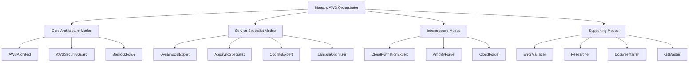

## Mode Interaction Patterns

### Pattern 1: Waterfall Integration

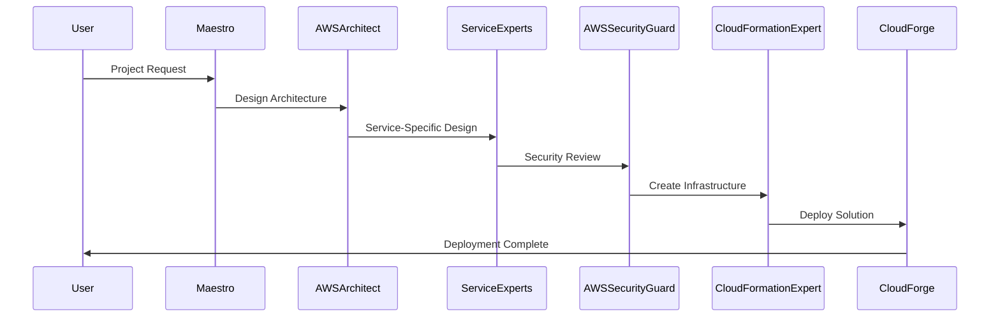

### Pattern 2: Parallel Processing

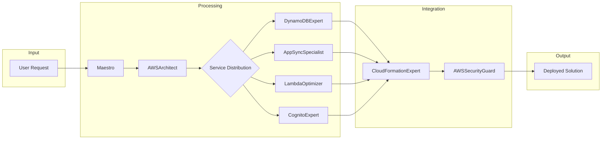

### Pattern 3: Iterative Refinement

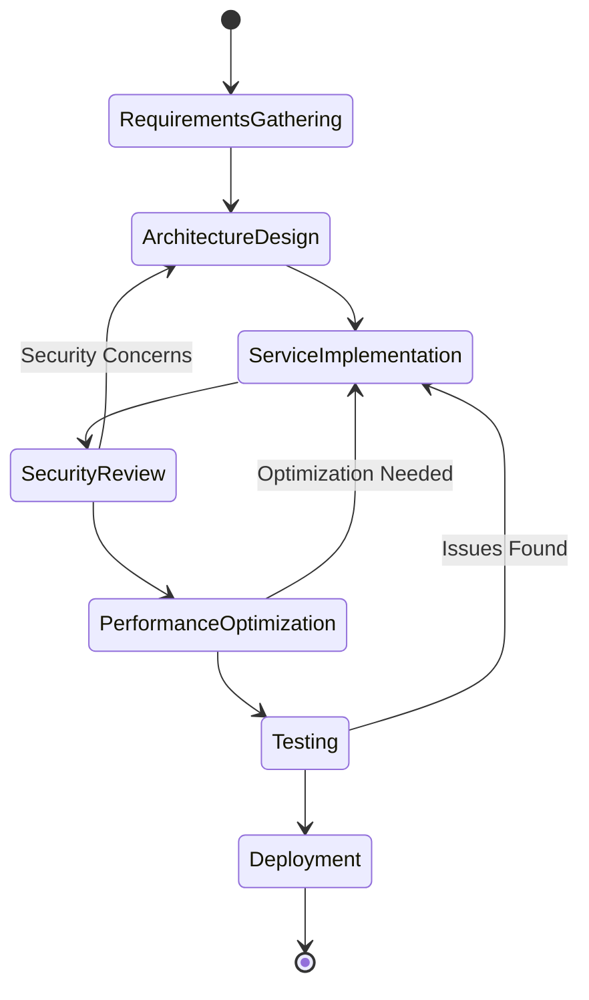

## Service Integration Map

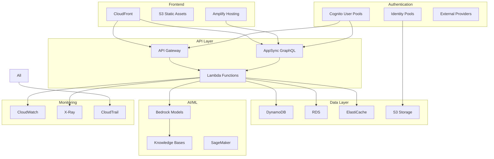

## Mode Collaboration Flows

### Flow 1: E-Commerce Platform Development

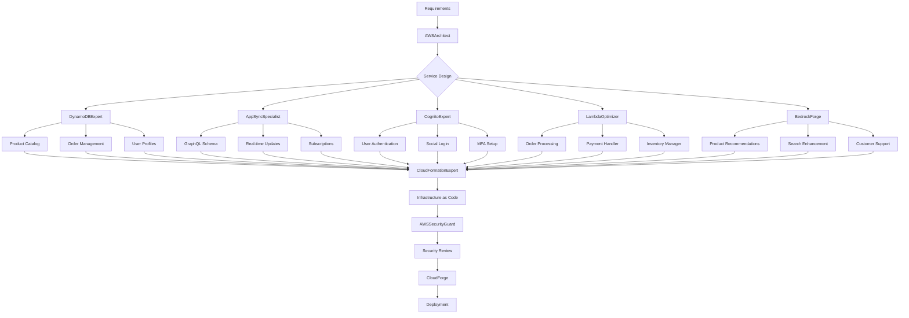

### Flow 2: Serverless Data Pipeline

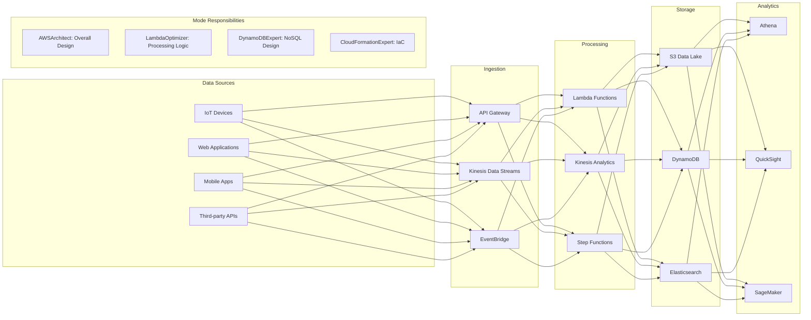

### Flow 3: AI-Powered Application

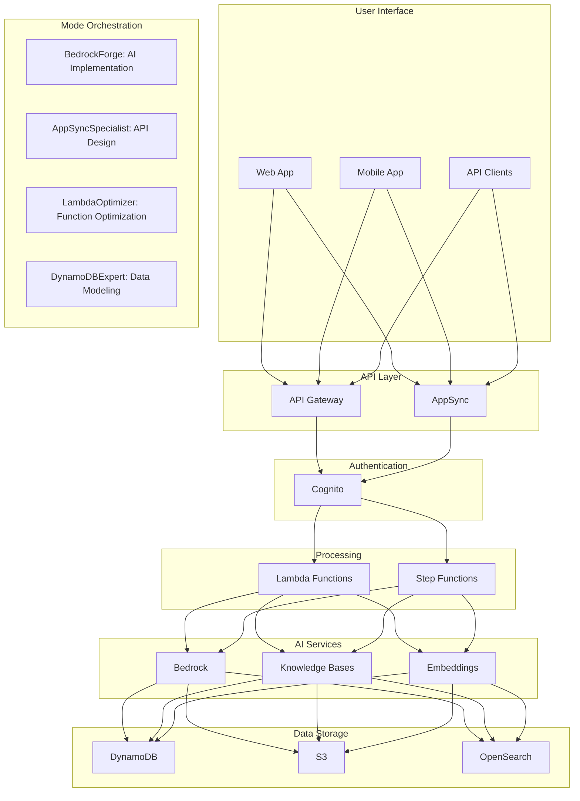

## Context Flow Diagram

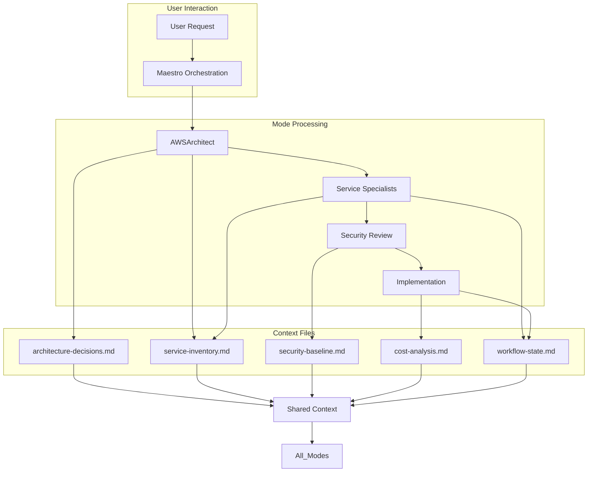

## Security Integration Flow

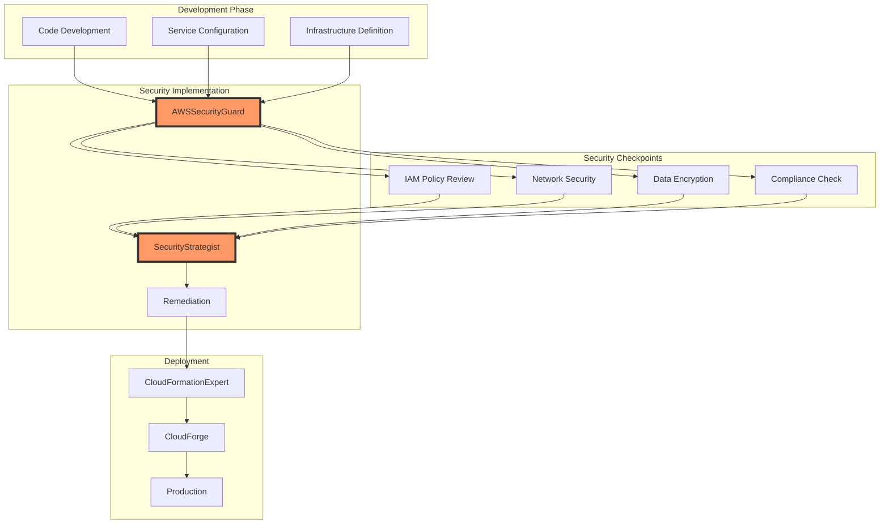

## Mode Communication Protocol

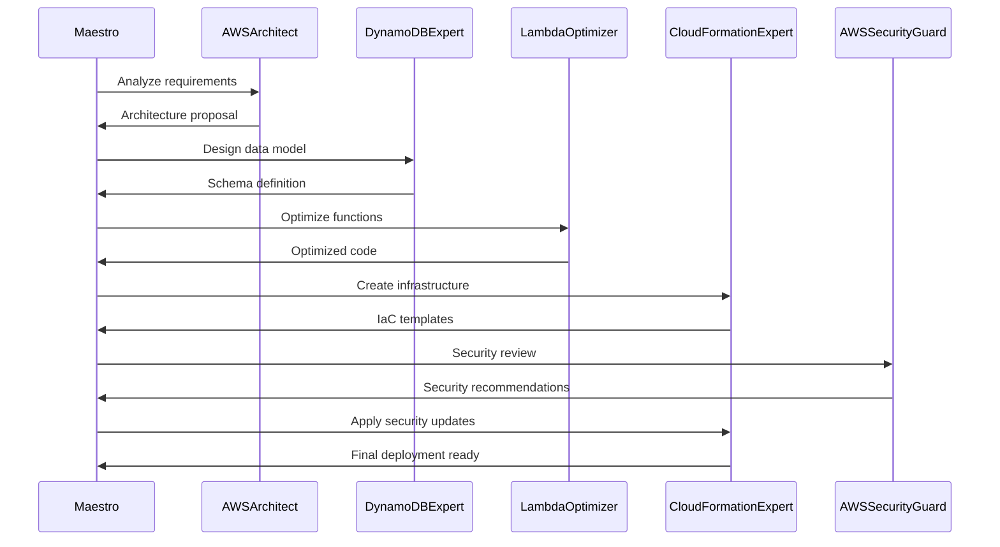

## Error Handling Flow

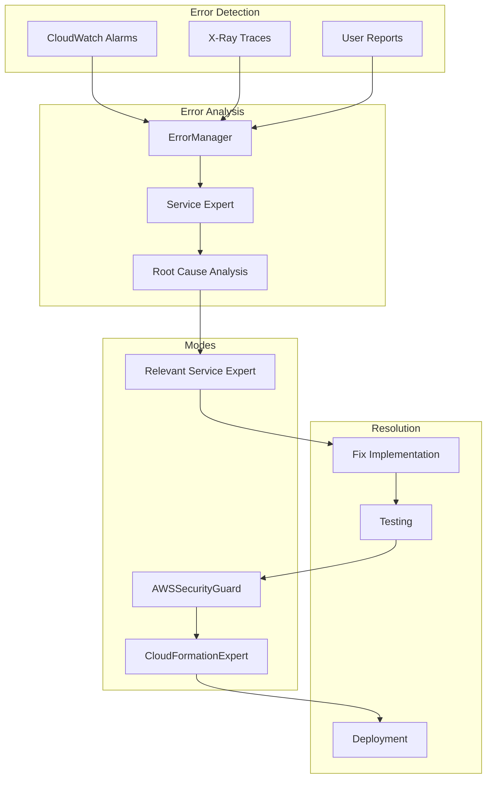

## Cost Optimization Flow

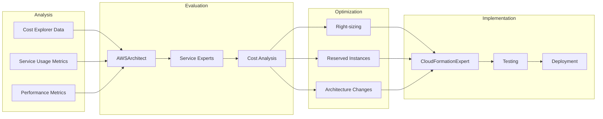

## Multi-Region Architecture Flow

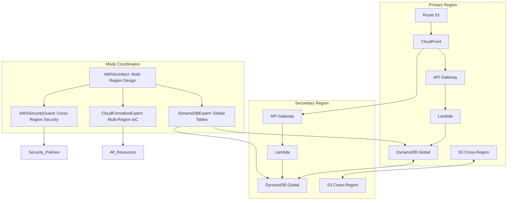

## DevOps Integration Flow

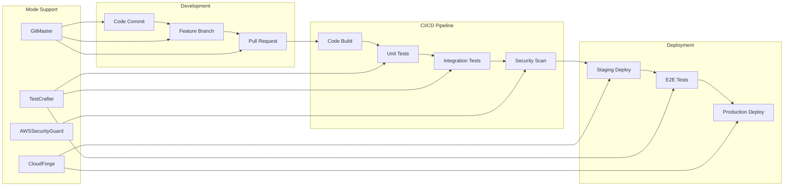

## Knowledge Base Architecture

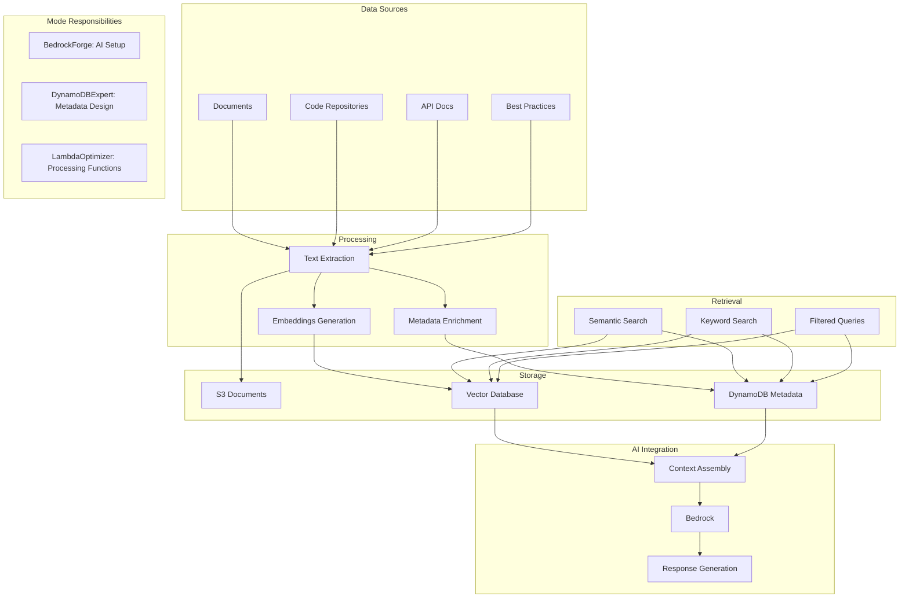

## Monitoring and Observability Flow

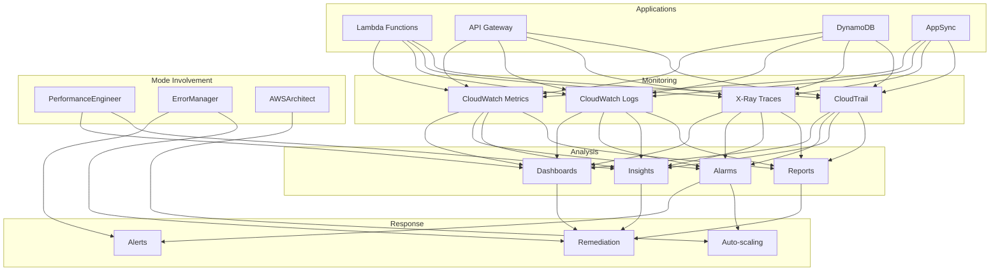

## Complete Application Architecture

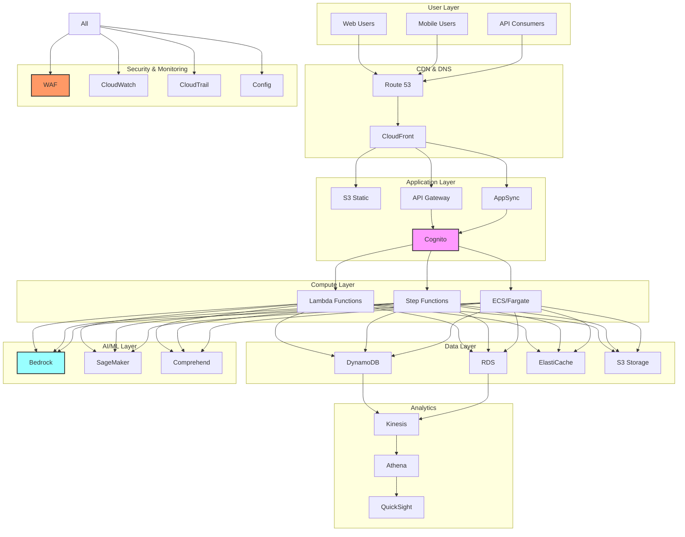

## Mode Selection Decision Tree

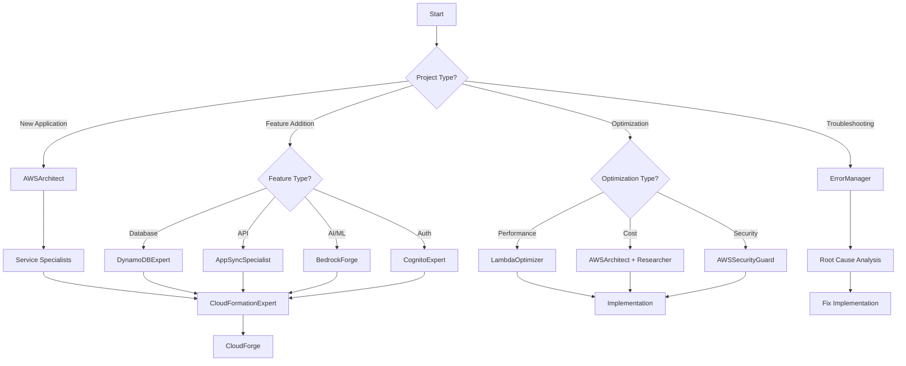

## Deployment Pipeline Flow

```mermaid
flowchart LR
    subgraph Development
        A[Local Dev]
        B[Unit Tests]
        C[Code Review]
    end
    
    subgraph Build
        D[CodeBuild]
        E[Docker Images]
        F[CloudFormation Templates]
    end
    
    subgraph Test
        G[Deploy to Test]
        H[Integration Tests]
        I[Security Scan]
    end
    
    subgraph Staging
        J[Deploy to Staging]
        K[E2E Tests]
        L[Performance Tests]
    end
    
    subgraph Production
        M[Blue/Green Deploy]
        N[Canary Deploy]
        O[Full Deploy]
    end
    
    A --> B --> C
    C --> D
    D --> E & F
    E & F --> G
    G --> H & I
    H & I --> J
    J --> K & L
    K & L --> M | N | O
    
    subgraph Mode Support
        P[CloudFormationExpert: IaC]
        Q[CloudForge: Deployment]
        R[AWSSecurityGuard: Security]
        S[TestCrafter: Testing]
    end
```

## Summary

These integration diagrams illustrate how AWS modes work together to deliver comprehensive solutions. Key insights:

1. **Hierarchical Organization**: Maestro orchestrates all mode interactions
2. **Sequential and Parallel Processing**: Modes can work in sequence or simultaneously
3. **Context Sharing**: All modes share context through common files
4. **Security Integration**: Security reviews happen at multiple checkpoints
5. **Iterative Refinement**: Feedback loops enable continuous improvement

Understanding these patterns helps users leverage the full power of the AWS mode set for building robust, scalable, and secure cloud applications.
