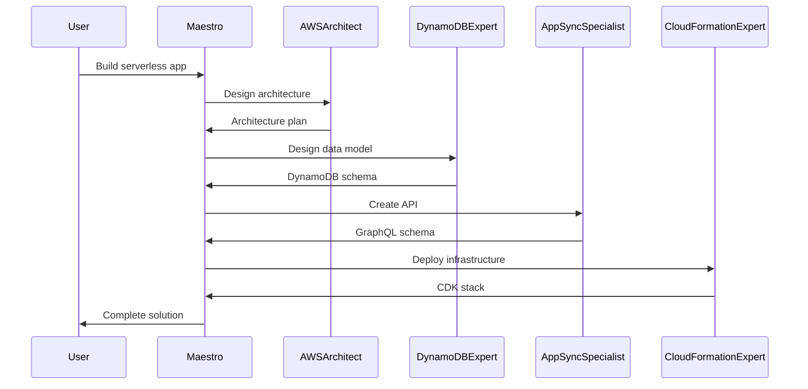
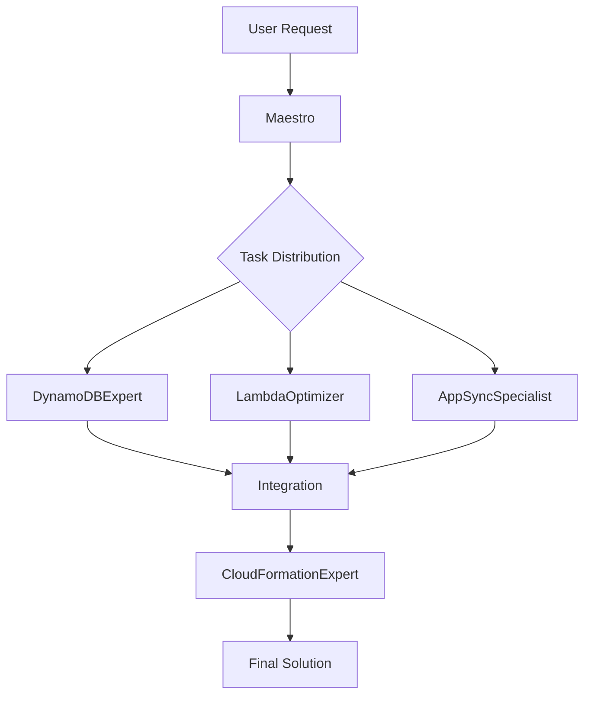
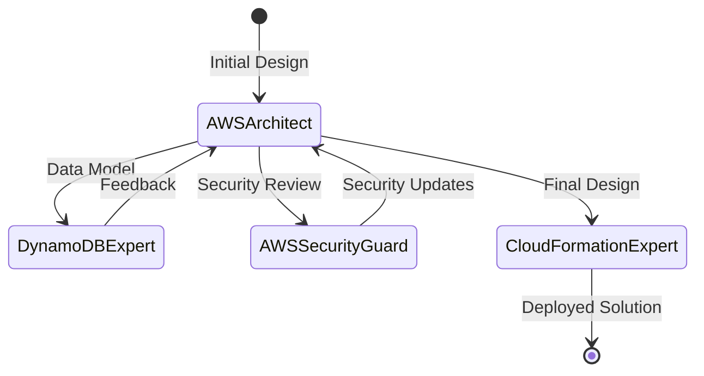
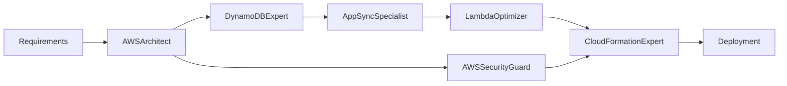
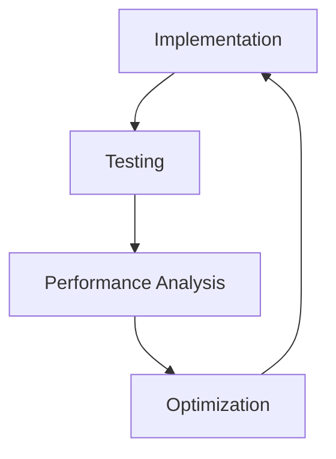

# AWS Mode Interactions Documentation

## Overview

This document details how AWS modes interact with each other to provide comprehensive solutions. Understanding these interactions helps users leverage the full power of the AWS mode set for complex development tasks.

## Mode Interaction Patterns

### 1. Sequential Processing

Modes often work in sequence, with each mode building upon the work of previous modes.



### 2. Parallel Processing

For complex tasks, multiple modes may work simultaneously on different aspects.



### 3. Iterative Refinement

Modes may pass work back and forth for optimization and refinement.



## Common Interaction Scenarios

### Scenario 1: Building a Serverless API

**Modes Involved**: AWSArchitect → DynamoDBExpert → AppSyncSpecialist → LambdaOptimizer → CloudFormationExpert

**Interaction Flow**:

1. **AWSArchitect** creates the overall design
   - Outputs: Architecture diagram, service selection
   - Context created: `/docs/aws/architecture-decisions.md`

2. **DynamoDBExpert** designs the data model
   - Inputs: Architecture decisions, data requirements
   - Outputs: Table schemas, access patterns
   - Updates: `/docs/aws/service-inventory.md`

3. **AppSyncSpecialist** creates the API
   - Inputs: Data model, API requirements
   - Outputs: GraphQL schema, resolver templates
   - Creates: API documentation

4. **LambdaOptimizer** implements functions
   - Inputs: API requirements, data access patterns
   - Outputs: Optimized Lambda functions
   - Considers: Performance, cost

5. **CloudFormationExpert** deploys everything
   - Inputs: All component definitions
   - Outputs: CDK/CloudFormation templates
   - Deploys: Complete infrastructure

### Scenario 2: Adding AI Capabilities

**Modes Involved**: AWSArchitect → BedrockForge → LambdaOptimizer → AWSSecurityGuard

**Interaction Flow**:

1. **AWSArchitect** designs AI integration
   - Analyzes existing architecture
   - Proposes AI service integration
   - Updates architecture documentation

2. **BedrockForge** implements AI features
   - Selects appropriate models
   - Designs RAG architecture
   - Creates knowledge bases
   - Implements guardrails

3. **LambdaOptimizer** creates processing functions
   - Integrates with Bedrock APIs
   - Optimizes for latency
   - Implements error handling

4. **AWSSecurityGuard** reviews security
   - Reviews IAM policies
   - Ensures data privacy
   - Validates compliance

### Scenario 3: Performance Optimization

**Modes Involved**: Multiple specialists → AWSArchitect → Implementation modes

**Interaction Flow**:

1. **Service Specialists** analyze performance
   - DynamoDBExpert: Query optimization
   - LambdaOptimizer: Function performance
   - AppSyncSpecialist: API efficiency

2. **AWSArchitect** consolidates recommendations
   - Reviews all suggestions
   - Proposes architectural changes
   - Balances trade-offs

3. **Implementation modes** apply changes
   - Update code and configuration
   - Modify infrastructure
   - Deploy improvements

## Mode Communication Protocols

### 1. Context Files

Modes communicate through shared context files:

```
/docs/aws/
├── architecture-decisions.md    # AWSArchitect primary
├── service-inventory.md        # All modes contribute
├── security-baseline.md        # AWSSecurityGuard primary
└── cost-analysis.md           # AWSArchitect maintains
```

### 2. Handoff Messages

Modes use structured handoff messages:

```json
{
  "from": "AWSArchitect",
  "to": "DynamoDBExpert",
  "task": "Design user data model",
  "context": {
    "requirements": ["multi-tenant", "high-volume"],
    "constraints": ["cost-sensitive", "low-latency"],
    "architecture": "serverless"
  },
  "artifacts": [
    "/docs/aws/architecture-decisions.md",
    "/docs/requirements/data-model.md"
  ]
}
```

### 3. Status Updates

Modes update shared status:

```markdown
## Workflow Status

### Phase 1: Architecture Design
- Status: Complete
- Mode: AWSArchitect
- Outputs: Architecture diagram, service selection
- Next: Data model design

### Phase 2: Data Model
- Status: In Progress
- Mode: DynamoDBExpert
- Dependencies: Architecture decisions
- Blockers: None
```

## Interaction Rules

### 1. Mode Boundaries

Each mode respects clear boundaries:

- **AWSArchitect**: Overall design, service selection
- **Service Experts**: Service-specific implementation
- **AWSSecurityGuard**: Security review and compliance
- **CloudFormationExpert**: Infrastructure deployment

### 2. Information Flow

```
Requirements → AWSArchitect → Design
     ↓
Design → Service Experts → Implementation
     ↓
Implementation → AWSSecurityGuard → Security Review
     ↓
Approved Design → CloudFormationExpert → Deployment
```

### 3. Conflict Resolution

When modes have conflicting recommendations:

1. **Maestro** identifies conflicts
2. **AWSArchitect** evaluates trade-offs
3. **Consensus** is reached through:
   - Priority assessment
   - Cost-benefit analysis
   - Security requirements
   - Performance needs

## Collaboration Patterns

### Pattern 1: Waterfall Collaboration

```
Step 1: AWSArchitect → Complete design
Step 2: DynamoDBExpert → Data model
Step 3: AppSyncSpecialist → API design
Step 4: LambdaOptimizer → Function implementation
Step 5: CloudFormationExpert → Deployment
```

### Pattern 2: Agile Collaboration

```
Sprint 1:
- AWSArchitect: MVP design
- DynamoDBExpert: Core tables
- LambdaOptimizer: Basic functions

Sprint 2:
- AppSyncSpecialist: API development
- AWSSecurityGuard: Security review
- CloudFormationExpert: Initial deployment

Sprint 3:
- BedrockForge: AI features
- LambdaOptimizer: Performance tuning
- CloudFormationExpert: Production deployment
```

### Pattern 3: Parallel Development

```
Thread 1: Backend Development
- DynamoDBExpert
- LambdaOptimizer
- CloudFormationExpert

Thread 2: API Development
- AppSyncSpecialist
- CognitoExpert
- CloudFormationExpert

Thread 3: AI Development
- BedrockForge
- LambdaOptimizer
- AWSSecurityGuard

Merge Point: AWSArchitect → Integration
```

## Mode Dependencies

### Dependency Matrix

| Mode | Depends On | Provides To |
|------|------------|-------------|
| AWSArchitect | Requirements | All modes |
| DynamoDBExpert | AWSArchitect | AppSyncSpecialist, LambdaOptimizer |
| AppSyncSpecialist | DynamoDBExpert | LambdaOptimizer, Frontend |
| LambdaOptimizer | DynamoDBExpert, AppSyncSpecialist | CloudFormationExpert |
| BedrockForge | AWSArchitect | LambdaOptimizer, AppSyncSpecialist |
| CognitoExpert | AWSArchitect | AppSyncSpecialist, Frontend |
| AWSSecurityGuard | All implementation | CloudFormationExpert |
| CloudFormationExpert | All modes | Deployment |

### Critical Paths



## Integration Points

### 1. Architecture Integration

- **AWSArchitect** provides framework
- All modes align with architecture
- Changes flow back to architect
- Architecture evolves iteratively

### 2. Security Integration

- **AWSSecurityGuard** reviews all components
- Security requirements flow to all modes
- IAM policies coordinated centrally
- Compliance checked throughout

### 3. Deployment Integration

- **CloudFormationExpert** collects all resources
- Infrastructure defined as code
- Dependencies managed automatically
- Deployment orchestrated systematically

## Best Practices for Mode Interaction

### 1. Clear Communication

- Use structured handoff messages
- Document all decisions
- Update shared context files
- Maintain workflow state

### 2. Respect Boundaries

- Each mode owns its domain
- Avoid overlapping responsibilities
- Escalate conflicts to Maestro
- Maintain clear interfaces

### 3. Iterative Refinement

- Start with MVP approach
- Refine through iterations
- Gather feedback continuously
- Optimize progressively

### 4. Documentation

- Document interaction patterns
- Record design decisions
- Track dependencies
- Maintain audit trail

## Troubleshooting Interactions

### Common Issues

1. **Circular Dependencies**
   - Symptom: Modes waiting on each other
   - Solution: AWSArchitect breaks cycle
   - Prevention: Clear dependency graph

2. **Context Conflicts**
   - Symptom: Contradictory requirements
   - Solution: Maestro mediates
   - Prevention: Regular synchronization

3. **Handoff Failures**
   - Symptom: Lost information
   - Solution: Structured messages
   - Prevention: Validation checks

### Resolution Process

1. Identify the issue
2. Determine affected modes
3. Maestro coordinates resolution
4. Update interaction patterns
5. Document lessons learned

## Advanced Interaction Patterns

### 1. Feedback Loops



### 2. Cross-Functional Teams

```
Team Alpha: Frontend
- AmplifyForge
- ReactMaster
- AppSyncSpecialist

Team Beta: Backend
- DynamoDBExpert
- LambdaOptimizer
- BedrockForge

Coordination: AWSArchitect + Maestro
```

### 3. Multi-Region Deployment

```
Region Planning: AWSArchitect
Data Replication: DynamoDBExpert
Traffic Routing: CloudFormationExpert
Security: AWSSecurityGuard
```

## Metrics and Monitoring

### Interaction Metrics

1. **Handoff Success Rate**
   - Successful transitions between modes
   - Information completeness
   - Time to complete handoff

2. **Iteration Count**
   - Number of refinement cycles
   - Convergence speed
   - Quality improvements

3. **Conflict Resolution**
   - Number of conflicts
   - Resolution time
   - Decision quality

### Monitoring Dashboard

```
Mode Interaction Dashboard
├── Active Workflows
├── Pending Handoffs
├── Blocked Tasks
├── Conflict Queue
└── Performance Metrics
```

## Future Enhancements

### Planned Improvements

1. **Automated Handoffs**
   - Smart routing
   - Context preservation
   - Validation checks

2. **Parallel Execution**
   - Concurrent processing
   - Dependency management
   - Resource optimization

3. **Learning System**
   - Pattern recognition
   - Optimization suggestions
   - Predictive routing

## Conclusion

Effective mode interaction is key to leveraging the full power of the AWS mode set. By understanding:

- Communication patterns
- Dependency relationships
- Integration points
- Best practices

Users can orchestrate complex AWS development tasks efficiently, with each mode contributing its specialized expertise to create comprehensive solutions.

Remember: Maestro orchestrates these interactions automatically, but understanding the patterns helps in:
- Providing better context
- Optimizing workflows
- Troubleshooting issues
- Achieving better results
