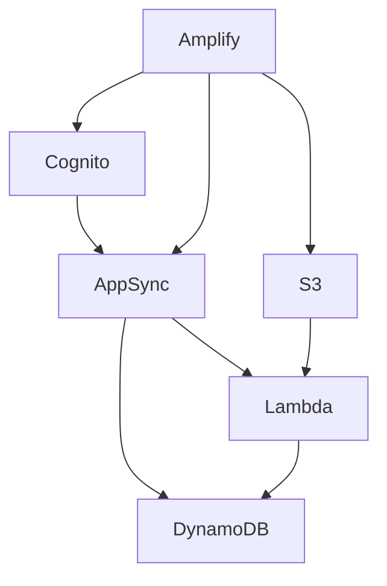

# AWS Service Inventory

## Active Services

### Core Services
| Service | Purpose | Mode Responsible | Status |
|---------|---------|------------------|--------|
| DynamoDB | Main data store | DynamoDBExpert | Active |
| AppSync | GraphQL API | AppSyncSpecialist | Active |
| Cognito | Authentication | CognitoExpert | Active |
| Lambda | Compute functions | LambdaOptimizer | Active |
| S3 | Object storage | AmplifyForge | Active |

### Infrastructure
| Service | Purpose | Mode Responsible | Status |
|---------|---------|------------------|--------|
| CloudFormation | IaC | CloudFormationExpert | Active |
| CloudWatch | Monitoring | AWSArchitect | Active |
| IAM | Access control | AWSSecurityGuard | Active |

### Amplify Resources
| Resource | Type | Configuration | Mode |
|----------|------|---------------|------|
| Backend | Amplify | TypeScript | AmplifyForge |
| Auth | Cognito | User pools | CognitoExpert |
| Data | AppSync | GraphQL | AppSyncSpecialist |
| Storage | S3 | Public/Private | AmplifyForge |
| Functions | Lambda | Node.js | LambdaOptimizer |

## Service Dependencies

## Cost Tracking
| Service | Monthly Cost | Trend | Optimization |
|---------|-------------|-------|--------------|
| DynamoDB | $XX | ↑/↓/→ | [Actions] |
| Lambda | $XX | ↑/↓/→ | [Actions] |
| AppSync | $XX | ↑/↓/→ | [Actions] |

## Service Limits
| Service | Resource | Current | Limit | % Used |
|---------|----------|---------|-------|--------|
| DynamoDB | Tables | X | 256 | X% |
| Lambda | Concurrent | X | 1000 | X% |
| AppSync | Requests/sec | X | 1000 | X% |

## Upcoming Changes
| Service | Change | Date | Impact | Mode |
|---------|--------|------|--------|------|
| [Service] | [Change] | [Date] | [Impact] | [Mode] |

## Service Health
- **Last Updated**: [Date/Time]
- **Health Checks**: All passing / Issues detected
- **Alerts Configured**: Yes / No
- **Monitoring Dashboard**: [Link]

## Notes
- [Important observations]
- [Optimization opportunities]
- [Planned improvements]
