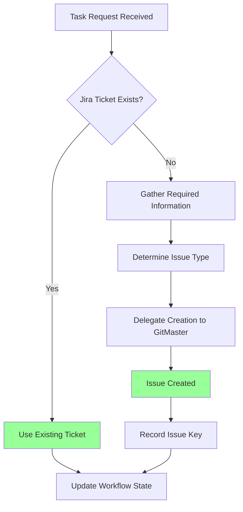

# Jira Issue Tracking Workflow Integration

This document outlines how Jira issue tracking is integrated into our development workflow, managed by the Maestro orchestrator and executed by specialized modes.

## Core Principles

- **Ticket Before Code:** All development work MUST have a corresponding Jira ticket.
- **Status Accuracy:** Jira statuses MUST reflect the real-time state of work.
- **Traceability:** Clear links MUST exist between Jira tickets, code branches, commits, and PRs.
- **Defined Completion:** Tickets are marked 'Done' ONLY after meeting all acceptance criteria, passing tests, and updating documentation.

## Workflow Integration

### CRITICAL RULES (MUST FOLLOW)

#### 🚨 ABSOLUTE REQUIREMENTS

╔═════════════════════════════════════════════════════════════════════════╗
║ 1. NEVER START WORK WITHOUT A CORRESPONDING JIRA TICKET                 ║
║ 2. ALWAYS INCLUDE JIRA ISSUE KEY IN BRANCH NAMES AND COMMIT MESSAGES    ║
║ 3. ALWAYS UPDATE JIRA STATUS WHEN TASK STATE CHANGES                    ║
║ 4. ALWAYS VERIFY ACCEPTANCE CRITERIA BEFORE MARKING TICKETS AS DONE     ║
╚═════════════════════════════════════════════════════════════════════════╝

### 1. Project Key Management Protocol

- **Detection/Prompting (Maestro):** Maestro MUST attempt to find `JIRA_PROJECT_KEY` in `.env` or `.jira`. If not found, Maestro MUST prompt the user.
- **Storage (Maestro):** The key MUST be stored in `/docs/project-management/project-context.md` and tracked for active requests in `/docs/project-management/workflow-state.md`.
- **Propagation (Maestro):** The key MUST be included in the context for any delegated task requiring Jira interaction.

#### ✅ PRE-ACTION CHECKLIST

```yaml
Before Starting Any Task:
  - [ ] JIRA_PROJECT_KEY identified in environment or config
  - [ ] Project key verified and stored in project-context.md
  - [ ] Workflow state file updated with current ticket information
  - [ ] Required context provided to all delegated modes
```

### 2. Ticket Lifecycle Protocol

#### 2.1. Ticket Creation

- **Responsibility:** Information gathered by `Strategist` (or `Maestro`), creation delegated to `GitMaster` (or potential `JiraManager`).
- **Process:**
    1. Need identified.
    2. Required fields gathered (see section 4). Relationships identified.
    3. Maestro creates task context file.
    4. Maestro delegates creation to `GitMaster` via `new_task`.
    5. `GitMaster` uses `jira-server.create_issue` tool.
    6. `issueKey` reported back to Maestro.
    7. Maestro records `issueKey` in `workflow-state.md`.

#### 🔄 DECISION FLOWCHART



#### 2.2. Starting Work ("In Progress")

- **Responsibility:** `Maestro` delegates update to `GitMaster`.
- **Process:**
    1. Maestro delegates implementation task.
    2. Maestro delegates Jira status update task to `GitMaster`.
    3. `GitMaster` uses `jira-server.update_issue` to set status to 'In Progress'.

#### 2.3. Development (Branches, Commits, PRs)

- **Branches (`GitMaster`):** MUST include `issueKey` in branch names (see `/docs/standards/code-standards.md`).
- **Commits (Coding Modes):** MUST include `issueKey` in commit messages (see `/docs/standards/code-standards.md`).
- **Pull Requests (`GitMaster`):** MUST reference `issueKey`(s) in PR descriptions.

#### 2.4. Ticket Completion ("Done")

- **Responsibility:** `Maestro` delegates final update after QA Protocol completion.
- **Process:**
    1. Implementation complete.
    2. Maestro initiates QA Protocol (Reviews, Testing, Doc Updates).
    3. All QA steps MUST pass/complete successfully.
    4. Maestro delegates final Jira update task to `GitMaster`.
    5. `GitMaster` uses `jira-server.update_issue` to set status to 'Done'.
    6. Maestro updates `workflow-state.md`.

### 3. Required Fields Protocol

#### 📋 QUICK REFERENCE

| Issue Type | Required Fields | Optional Fields |
|------------|----------------|----------------|
| Story | • Acceptance criteria<br>• User-focused description ("As a..., I want..., so that...") | • Parent Epic link<br>• Story points |
| Bug | • Steps to reproduce<br>• Expected behavior<br>• Actual behavior | • Screenshots<br>• Environment info |
| Task | • Clear definition of done | • Estimated effort |
| Epic | • Business objective/goal<br>• High-level scope<br>• Success metrics/KPIs | • Dependencies<br>• Estimated timeline |

### 4. Issue Linking & Hierarchy Protocol

- Relationships MUST be identified by `Strategist`/`Visionary`.
- Linking information MUST be included in creation delegation message by Maestro.
- `GitMaster` MUST use `epic-link` custom field or `jira-server.create_issue_link` tool during creation.

#### ✅ CORRECT vs INCORRECT PATTERNS

✅ CORRECT: Issue Linking
```
"This ticket implements part of PROJ-123, and is blocked by PROJ-124."
```

❌ INCORRECT: Issue Linking
```
"This relates to the login functionality ticket."
```

### 5. Tool Usage Protocol

#### 🔑 JIRA SERVER MCP TOOLS

```
create_issue → Creates new tickets with required/optional fields
update_issue → Updates status, assignee, description, priority, summary
create_issue_link → Links related issues with relationship type
get_issues → Retrieves issues matching JQL query
get_user → Gets account ID by email for assignment
```

### QUICK REFERENCE CARD

#### 🎮 COMMON SCENARIOS

```
New Feature → Strategist gathers requirements → GitMaster creates Story → issueKey recorded
Bug Found → Steps documented → GitMaster creates Bug → Link to affected features
Starting Task → GitMaster updates status "In Progress" → Create branch with issueKey
Completing Task → Verify acceptance criteria → Run tests → Update docs → GitMaster sets "Done"
```

#### 🔑 KEY PRINCIPLES

1. **ALWAYS create ticket before code** - No exceptions
2. **ALWAYS include issueKey in all code artifacts** - Branches, commits, PRs
3. **ALWAYS keep Jira status accurate** - Update immediately when state changes
4. **NEVER mark "Done" without meeting all criteria** - Tests, reviews, documentation

### REMEMBER

All development work MUST be tracked in Jira with complete traceability from requirements to delivery.

**"The ticket is the single source of truth for work status and requirements."**